# Context

The goal of this lab is to help pentesters learn how to conduct a phishing campaign using GoPhish and Evilginx. It covers SMTP relay service configuration, GoPhish and Evilginx installation and configuration, domain name and VPS purchase, TLS certificate configuration, and defensive measures to detect a phishing website.  

# Table of Contents

- [Phishing Campaign Preparation](#phishing-campaign-preparation)
- [Domain Name Purchase](#domain-name-purchase)
- [VPS Purchase](#vps-purchase)
   * [VPS Configuration](#vps-configuration)
- [GoPhish](#gophish)
   * [Installation](#installation)
   * [Configuration](#configuration)
      + [Firewall Rules](#firewall-rules)
      + [SMTP Relay Service](#smtp-relay-service)
      + [Admin Panel Server](#admin-panel-server)
      + [Phishing Server](#phishing-server)
      + [TLS Certificate](#tls-certificate)
      + [Sending Profiles](#sending-profiles)x
      + [Email Templates](#email-templates)
      + [Landing Pages](#landing-pages)
      + [Users & Groups](#users-groups)
      + [Campaigns](#campaigns)
- [Evilginx Community](#evilginx-community)
   * [Installation and Configuration](#installation-and-configuration)
   * [Phishlets](#phishlets)
   * [Lures](#lures)
   * [Sessions](#sessions)
- [GoPhish x Evilginx](#gophish-x-evilginx)
- [Pitfalls to avoid during a phishing campaign](#pitfalls-to-avoid-during-a-phishing-campaign)
- [Tips and Tricks](#tips-and-tricks)
- [Resources](#resources)
- [Disclaimer](#disclaimer)


# Phishing Campaign Preparation

A phishing campaign is a simulated cyberattack that consists of tricking users into revealing sensitive data or perform dangerous actions, such as downloading and installing malicious attachments, which can lead to their account or system compromise. The goal of this assessment is to test how well users respond to fraudulent emails and raise their awareness by providing them with tips to detect those emails.  

Here are some steps that can help you conduct a successful phishing campaign:  

1- Perform technical enumeration such as directory fuzzing, subdomains and vhosts fuzzing, WHOIS and DNS records enumeration. The goal here is to identify the internal and third-party applications used by employees.  
2- Perform some basic OSINT (Open Source Intelligence) such as gathering employees' usernames, emails, and leaked credentials. This step can be taken further by checking employees' social media activity and their interests for spear phishing scenarios.  
3- Purchase and configure your phishing domain name.  
4- Choose an email delivery system or SMTP relay service (Google Workspace, Mailgun, Mailtrap, SendGrid, etc.) for sending your emails. The advantage of using well-known email providers is that they already have a strong reputation, which can help you evade spam filters.  
5- Configure Evilginx or GoPhish to host your phishing website and capture credentials.  
6- Launch your phishing campaign.  
7- Raise employees' awareness and provide technical recommendations to reduce the impact of phishing attacks.  

It is important to understand your client's needs. For instance, make sure you understand the goal and type of phishing campaign (mass phishing campaign, spear phishing campaign, whaling phishing campaign) they want. This will help you conduct a better assessment and provide value to them.  

# Domain Name Purchase

To purchase a domain name you can use [Namecheap](https://www.namecheap.com/domains/).  

**1/ Enter a domain name without the TLD**  

As you can see below, I entered **phishlab** in the search bar, and Namecheap returned some results like `phishlab.inc`, `phishlab.online`, etc.  

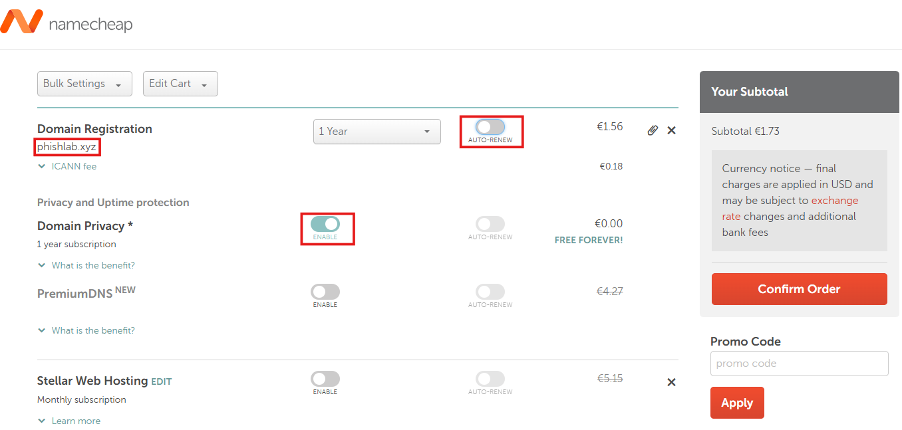

Depending on your budget, add a domain name to your cart, then follow the next instructions.  

**2/ Confirm the order**  

Before confirming your order, make sure you disable the **auto-renew** option for your domain. If enabled, this will automatically renew your subscription. Once done, click on `Confirm Order`.  

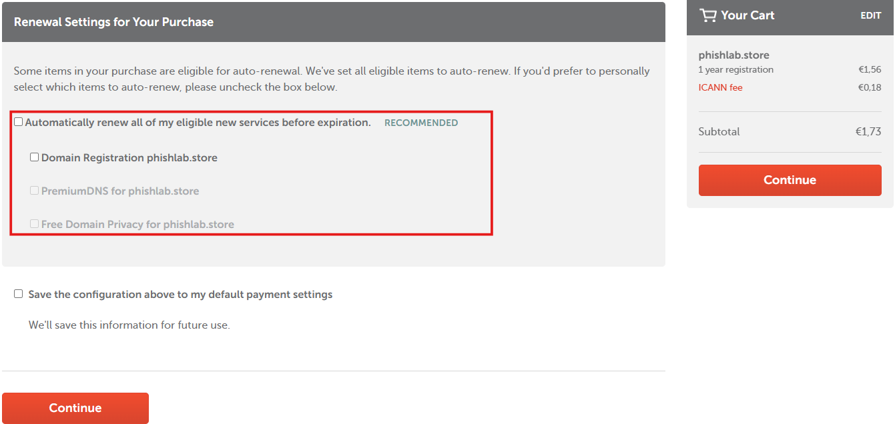

<br></br>

**3/ Enter your credit card information and purchase your domain**  

The final step consists of purchasing your domain name after entering your credit card information.  
Moreover do not select any additional options if not required. Once done, click on `Continue`.  

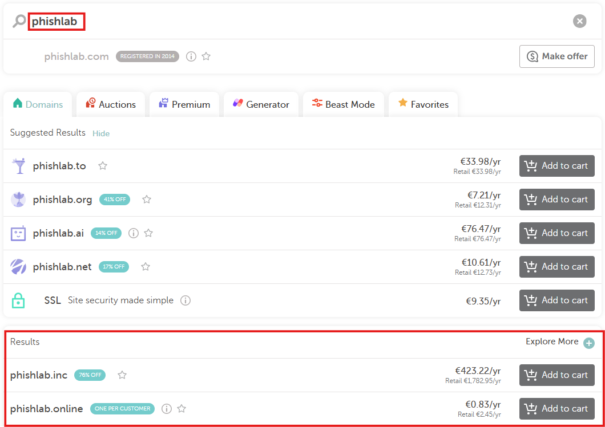

<br></br>

**4/ Access your purchased domain**  

Here is how to access your domain:  

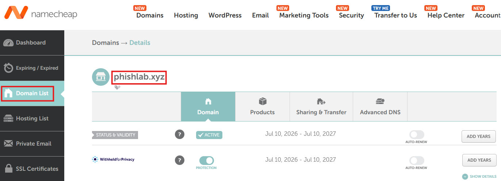

# VPS Purchase

A VPS (Virtual Private Server) is a virtual machine with its dedicated virtualized CPU, memory, storage, and network resources that is rented to you by a cloud or hosting provider. The name can vary from one supplier to another:  

- AWS called them EC2
- GCP called them compute engine instances
- Azure called them virtual machines
- DigitalOcean called them droplets

As you can see, there are many VPS on the market. For this lab, I rented a VPS on [Namecheap](https://www.namecheap.com/hosting/vps/) with the Pulsar plan. Feel free to choose what you want.  

Here are the steps to buy a VPS on Namecheap:  

**1/ Select your VPS formula**  

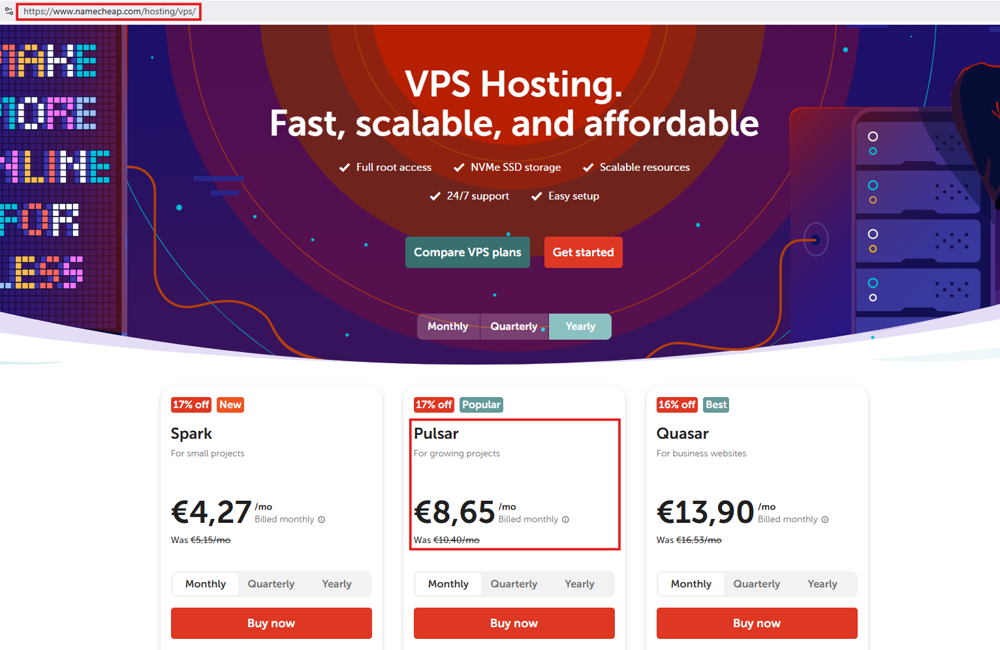  

<br></br>

Do not select any additional CPU, memory or hard drive space as this will cost you extra fees.  
  
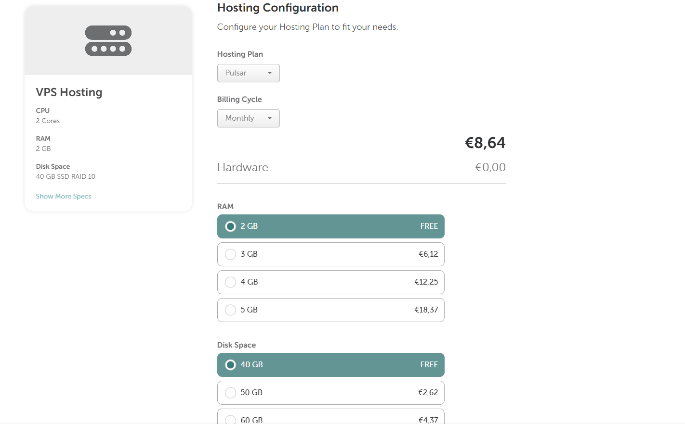  

<br></br>

**2/ Configure your VPS domain name, then add it to your cart**  
  


<br></br>

**3/ Confirm your order**  

Disable the **auto-renew** button when confirming your order, otherwise your subscription will automatically be renewed after its expiration.  


<br></br>

**4/ Purchase your VPS**

Click on **Pay Now** after reviewing the details of your purchase and agreeing to the Terms of Service:  

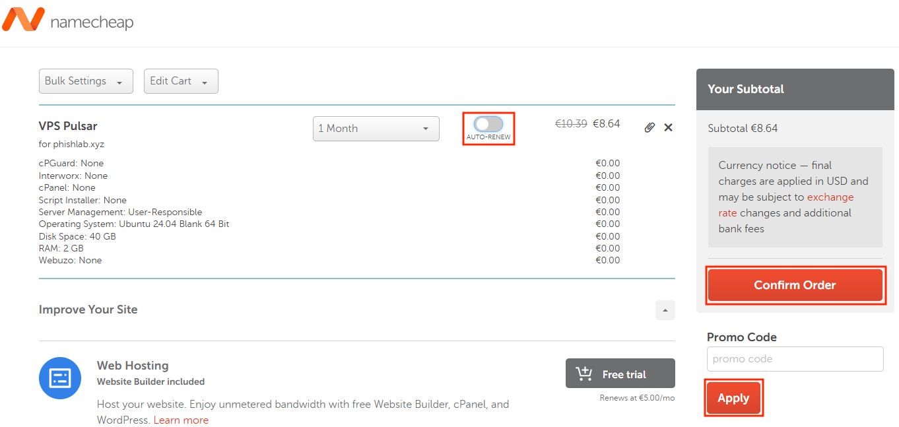

<br></br>

Going back to your [dashboard](https://ap.www.namecheap.com/dashboard), you should see a server icon next to your domain name:  

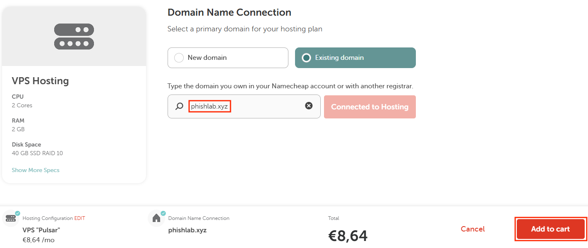


<br></br>

> Note that the VPS activation takes some time (**generally 15 minutes**). Therefore be patient. Once the VPS activated, you will receive the IP address and credentials in your mailbox.  

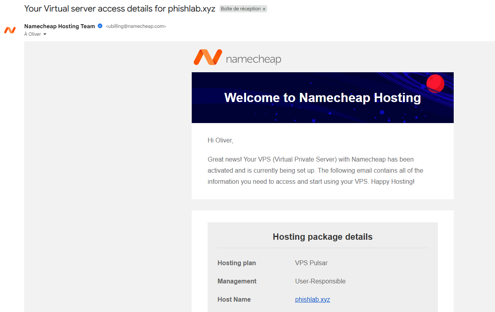

At the bottom of the mail, you will find your SSH credentials as well as the credentials to log in to the VPS admin panel.  

To manage your VPS, click on the `Hosting List` section, then click on `GO TO VPS PANEL`:  

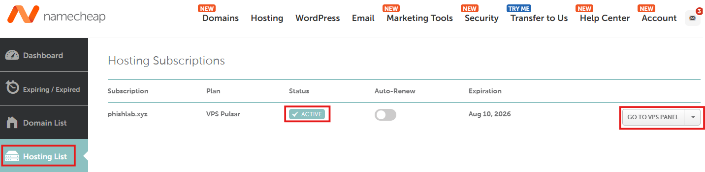

<br></br>

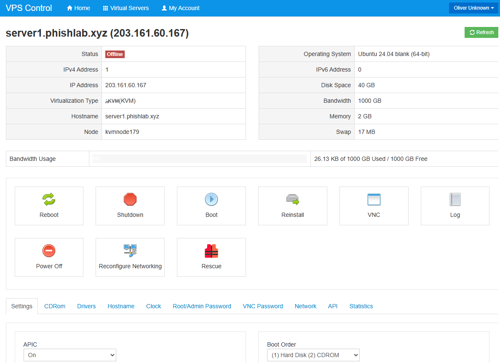

## VPS Configuration

Before trying to authenticate to your VPS, it must be online.  

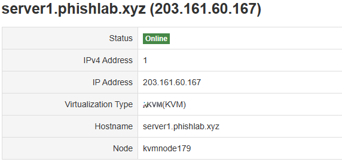

Once this check done, you can use `ssh` to remotely access your server with the credentials provided in the mail you received:  

```bash
ssh root@<vps_ip_address>
```

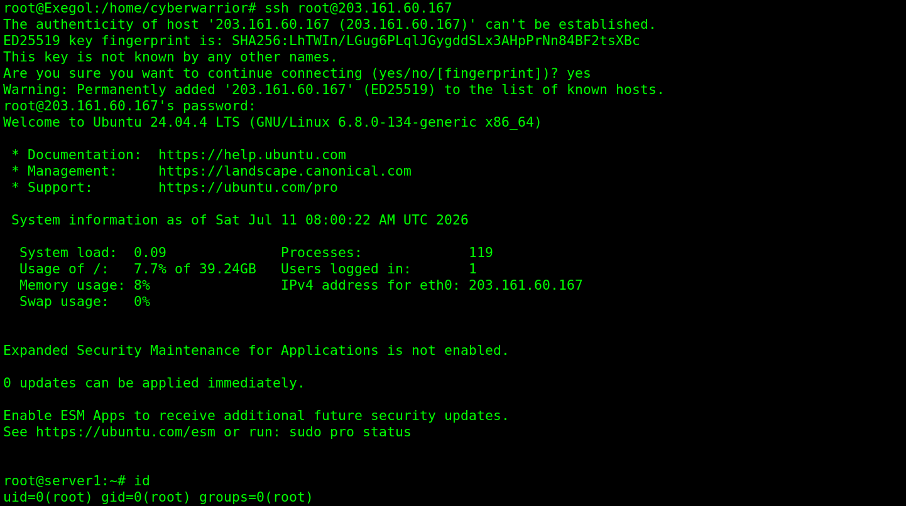

One of the first command to execute after connecting to your VPS is:  

```bash
sudo apt update
```

You can then generate an SSH key pair and disable password authentication for security reasons:  

```bash
ssh-keygen -t ed25519 -N '' -f id_ed25519
```

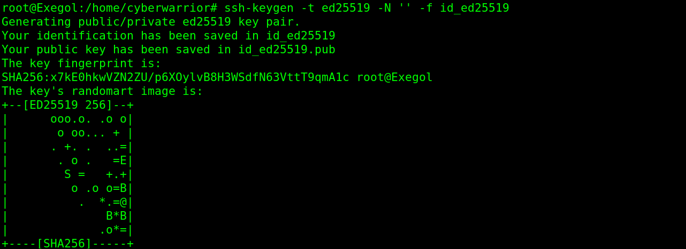

Copy your public key in the `.ssh` directory of your root user:  

```bash
ssh-copy-id -i ~/.ssh/id_ed25519.pub root@<vps_ip_address>
```

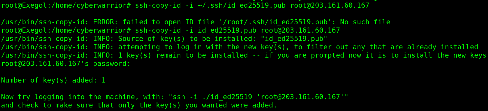

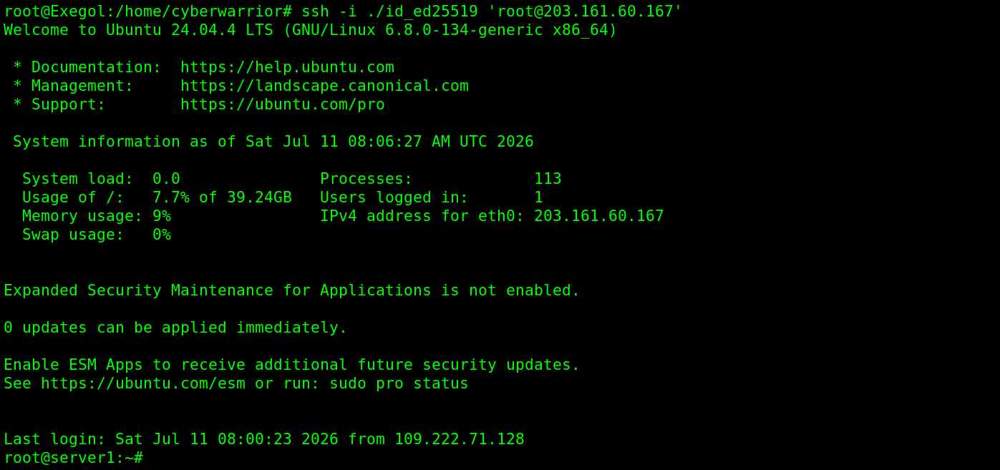


To disable SSH password authentication, use this command:  

```bash
nano /etc/ssh/sshd_config
```


```bash
systemctl restart ssh.service
```

# GoPhish

[GoPhish](https://github.com/gophish/gophish) is a phishing toolkit that can be used to quickly and easily setup and execute phishing campaigns.  

## Installation

The fastest way to install GoPhish is via the [release](https://github.com/gophish/gophish/releases/) file.  

```bash
wget https://github.com/gophish/gophish/releases/download/v0.12.1/gophish-v0.12.1-linux-64bit.zip
```

```bash
apt install -y unzip
unzip ./gophish-v0.12.1-linux-64bit.zip -d gophish
```

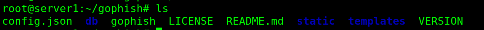


## Configuration

### Firewall Rules

Depending on the VPS you're using, the firewall configuration may differ. If you're using a VPS from Namecheap, follow the next steps, otherwise you can skip this part. That said, make sure that ports tcp/80, tcp/443, and tcp/22 are open on your VPS. Feel free to visit your VPS supplier documentation to learn more about that.  
To configure the firewall rules for a Namcheap VPS, you can use [ufw](https://help.ubuntu.com/community/UFW).  
To check the status of the firewall, use this command:  

```bash
ufw status
```

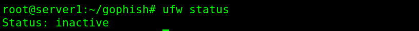

As you can see, the firewall is disabled (inactive). To enable it, use this command:  

```bash
ufw enable
```

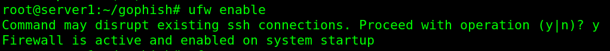

After enabling the firewall, open ports 80, 443, and 22:  

```bash
ufw allow 443
ufw allow 80
ufw allow 22
```

Once done, you can check if the settings were properly applied using this command:  

```bash
ufw status
```

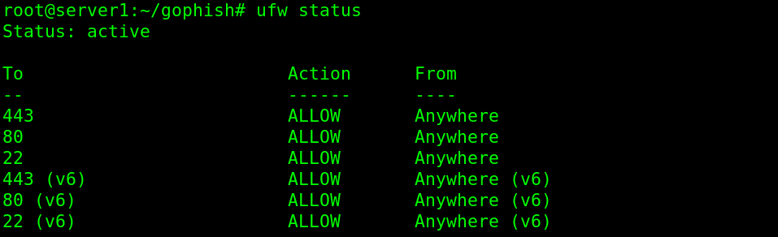

Let's now configure our SMTP relay service.  

### SMTP Relay Service

There are numerous SMTP relay services (Google Workplace, SendGrid, Mailgun, Mailtrap, etc). For this lab, I used [SendGrid](https://www.twilio.com/en-us/sendgrid). Skip the steps below if you used another SMTP relay service.  

To start with SendGrid, you will need to configure the domain name from which your emails will be sent. To do that, go to `Settings > Sender Authentication`, then click on `Authenticate your Domain`:  

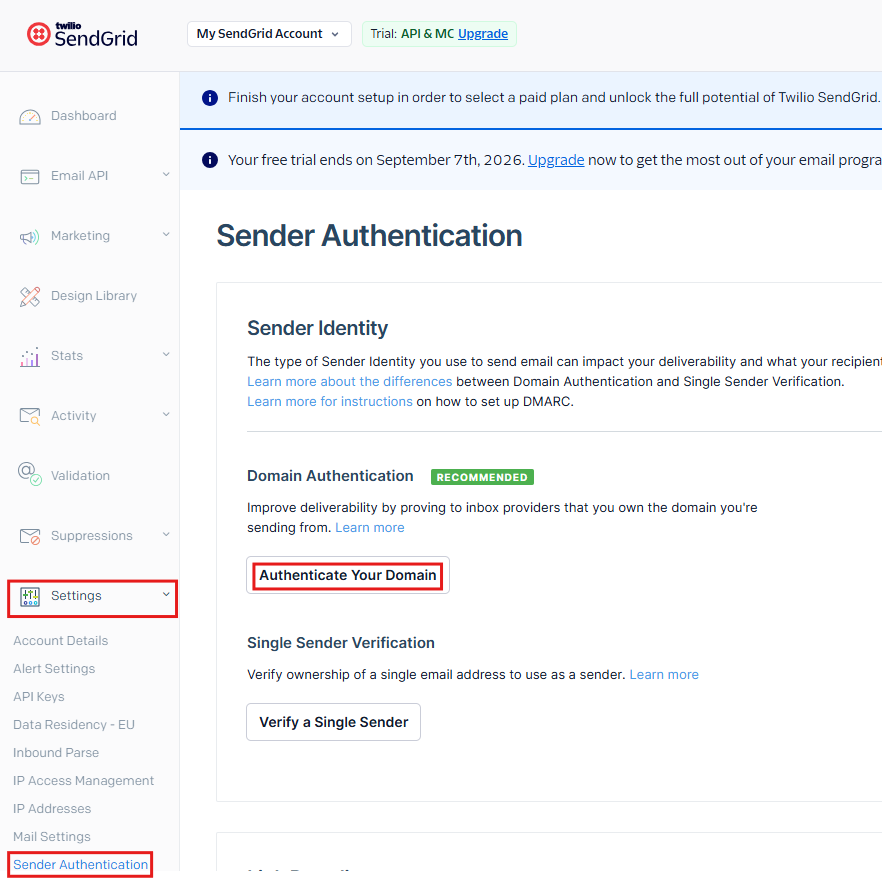

After that, specify your phishing domain name, then click on next:  

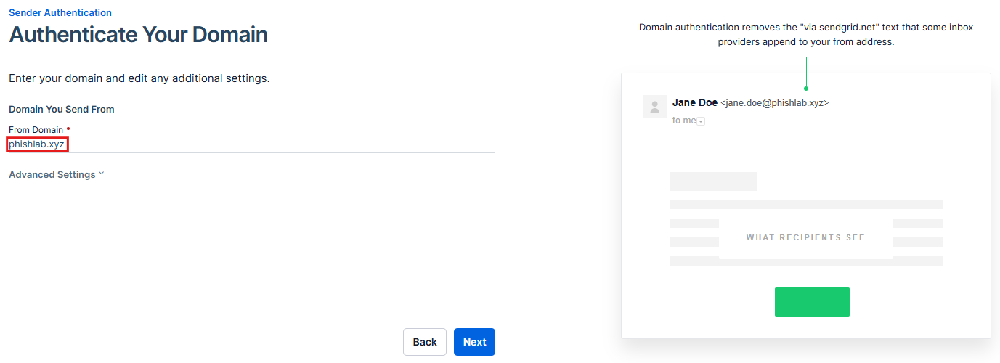

Then, you will need to add the following DNS records to your domain:  

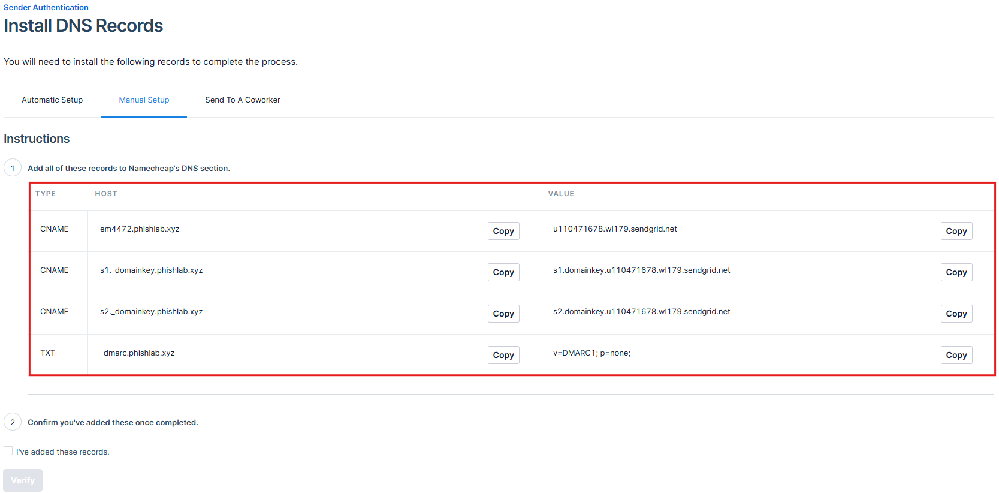

To do that, go back to Namecheap's `Domain List`, then click on `Manage`:  

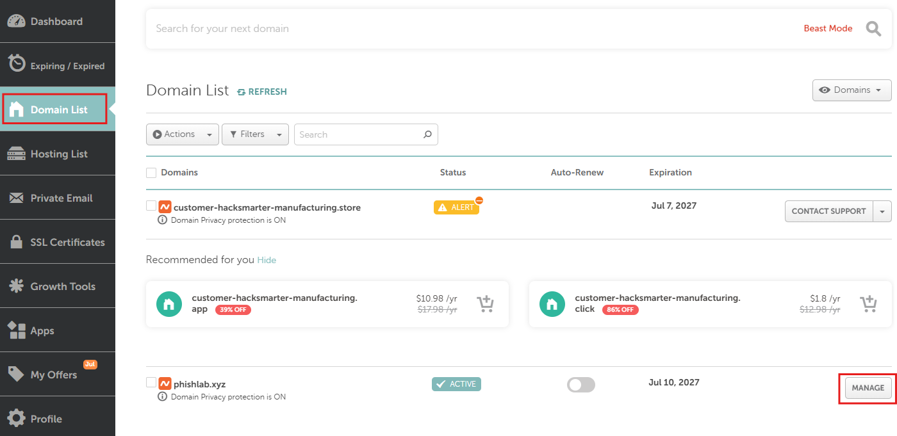

Next, click on `Advanced DNS`:  

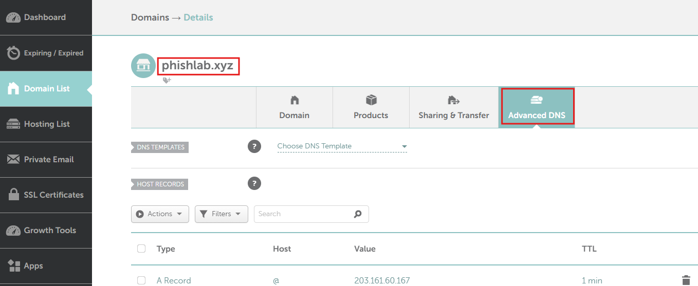

Finally, go down and click on the `ADD NEW RECORD` button:  

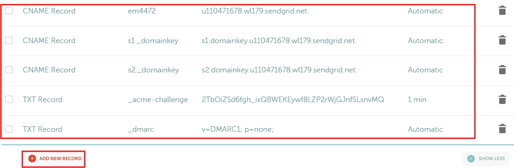

After adding all the records highlighted above, go back to SendGrid and check the box `I've added these records`, then click on Verify:  

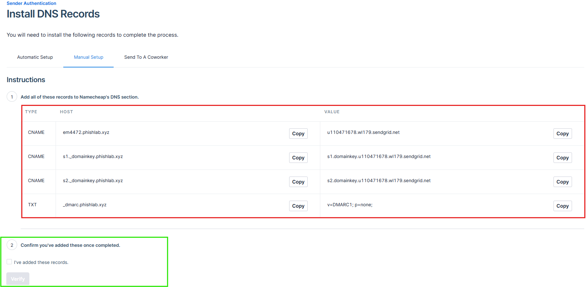

If everything goes as planned, you must see a new column `Status` with the value `Verified`:  

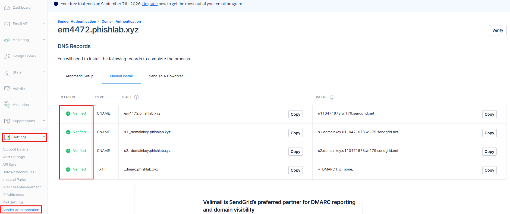

To get the SMTP server information (user, password, email server, etc.), go to `Email API > Integration Guide`, then select `SMTP Relay`:  

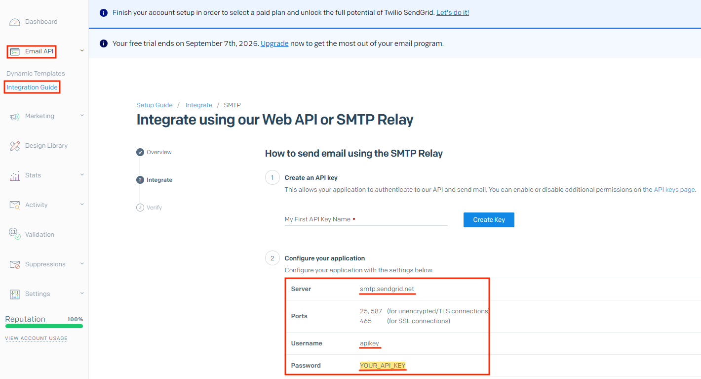

<br></br>

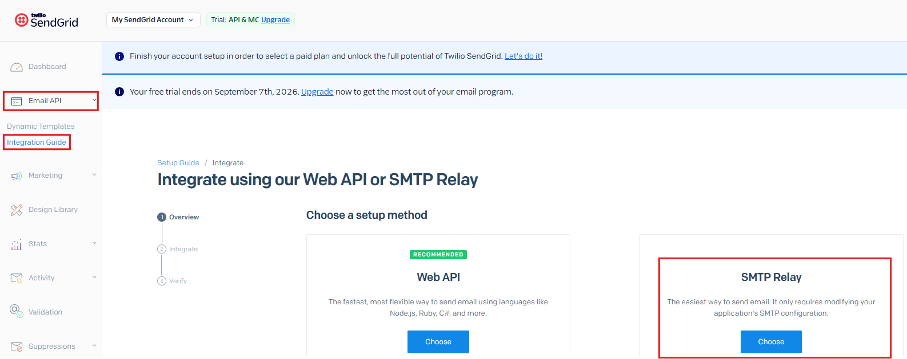

As you can see, the server name and username are respectively **smtp.sendgrid.net** and **apikey**. The password is your API key.  

To generate an API key, go to `Settings > API Keys`, then create a new API Key:  

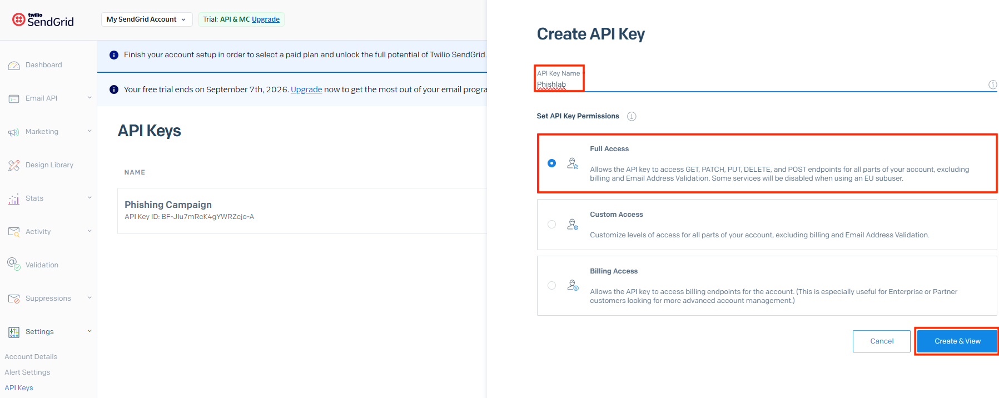

<br></br>

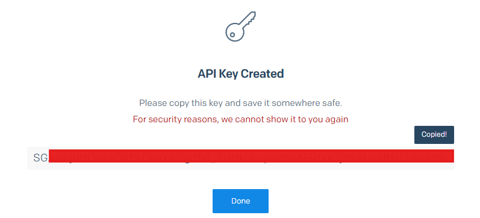

Make sure to copy your API Key in a secure place as you won't be able to retrieve it again.  
Well, let's now configure GoPhish's admin panel server.  

### Admin Panel Server

To configure GoPhish, we are going to edit the `config.json` file located in GoPhish root directory.  

Here is its default content:  

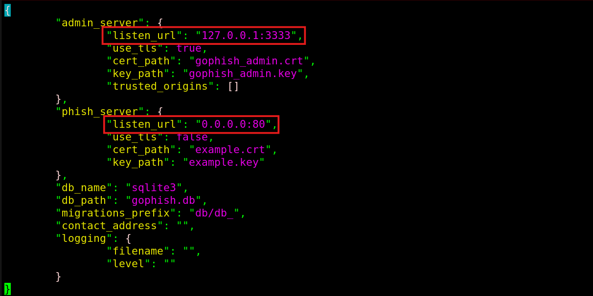

To start, change the `listen_url` of your Gophish Admin Server to `0.0.0.0:3333` to listen on all interfaces. To do that, you can use your favorite command line editor, or simply use this command:  

```bash
sed -i 's/127.0.0.1/0.0.0.0/g' config.json
```

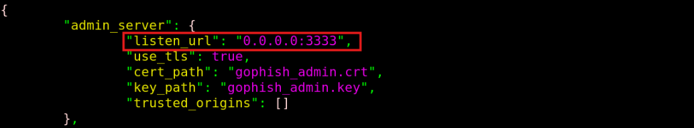

If you do not want to change the local IP address to `0.0.0.0`, you could use a SSH local port forwarding from your attacker machine:  

```bash
ssh <your_vps_username>@<your_vps_server> -L 127.0.0.1:3333:localhost:3333
```

The command above allows you to access the GoPhish admin login panel from your attacker machine without exposing it on the Internet.  

In this lab, we will restart GoPhish after every change made to the configuration file. As you can guess it, this can quickly become time consuming. To cope with that, we will create a GoPhish service by editing `/etc/systemd/system/gophish.service` with the following content:  

```bash
nano /etc/systemd/system/gophish.service
```

```bash
[Unit]
Description=gophish-service

[Service]
Type=simple
WorkingDirectory=$HOME/gophish/
ExecStart=$HOME/gophish/gophish

[Install]
WantedBy=multi-user.target
```

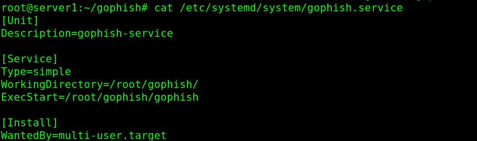

> Do not hesitate to change `$HOME/gophish/` if you installed GoPhish in another directory.  

Once done, you can enable your `GoPhish` service using this command:  

```bash
sudo systemctl enable /etc/systemd/system/gophish.service
```

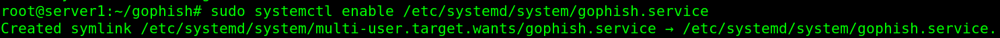

After that, you can start the service with this command:  

```bash
chmod +x $HOME/gophish/gophish
sudo systemctl start gophish
```

Note that, you must give execution permissions to the `gophish` binary before starting the service, otherwise it will fail to start.

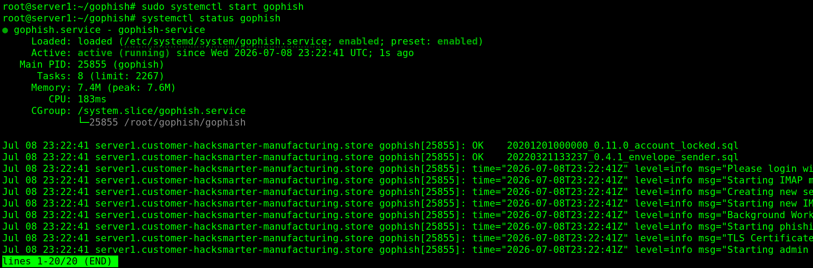

To get GoPhish admin panel's password, run the binary:  

```bash
./gophish
```

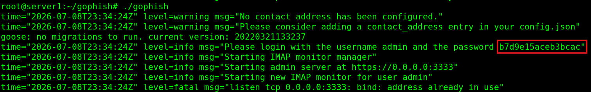

> By default, GoPhish generates a random password of 16 alphanumerical characters. The default username is `admin`.  

For security reasons, we will configure our firewall to prevent anyone from accessing our GoPhish admin panel. To do that, execute the following command in your Namecheap VPS:  

```bash
sudo ufw allow from <your_public_ip_address> to any port 3333
```

To get your public IP address, run `curl ifconfig.me`.  

To check if the configurations were successfully applied, use this command:  

```bash
ufw status
```

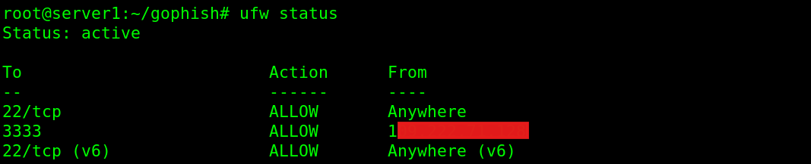

Let's now access GoPhish admin panel:  

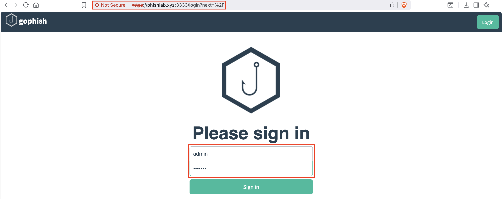

After specifying your credentials, you will need to reset your password:  

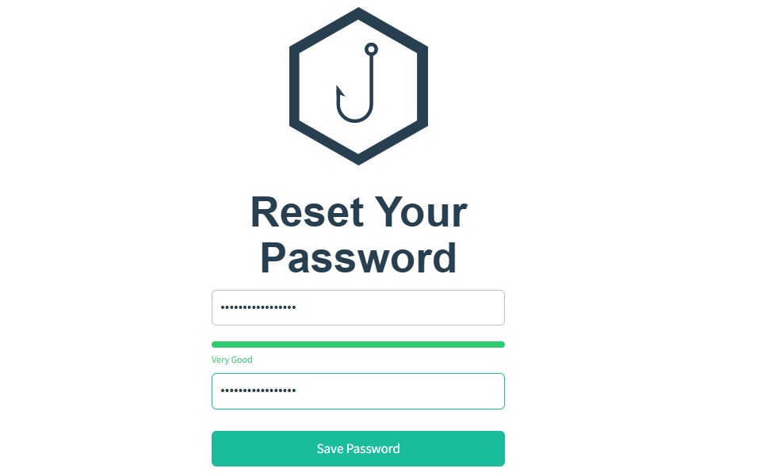

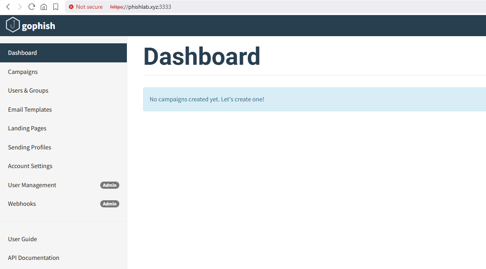

### Phishing Server

In this section, we are going to configure the phishing server that will host our phishing website.  
By default, this port listens on `0.0.0.0:80`. To access it, you will first need to link your phishing domain with your VPS IP address. This can be done by adding an `A` record to your DNS configuration.  


> The **@** symbol represents the root (apex) domain. This is a shorthand for the domain itself (phishlab.xyz), not a subdomain.   

To check if the record was successfully added, use this command:  

```bash
nslookup phishlab.xyz
```

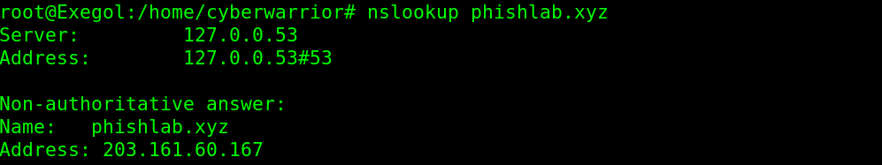

As you can see, nslookup resolution worked which means that my record was successfully added.  
After that, you should be able to access your phishing domain:  

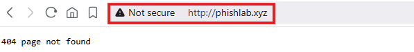

By default, this returns the default 404 page. However, it works!  

Using an HTTP website for a phishing campaign is not a great idea as it may raise suspicion among employees. To increase the chances of our phishing campaign, we'll add a TLS certificate to our phishing website and configure it to listen on port 443.  

### TLS Certificate

By default, your phishing server listens on port 80, which may trigger warnings in the target's browser.  

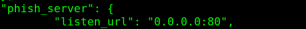

To deal with that, let's first install [certbot](https://certbot.eff.org/pages/about):  

```bash
sudo apt install -y certbot
```

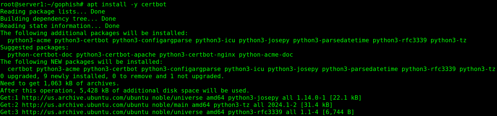

To generate a new `Let’s Encrypt` certificate, use this command:  

```bash
certbot certonly -d '<your_phishing_domain_name>' --manual --preferred-challenges dns --register-unsafely-without-email
```

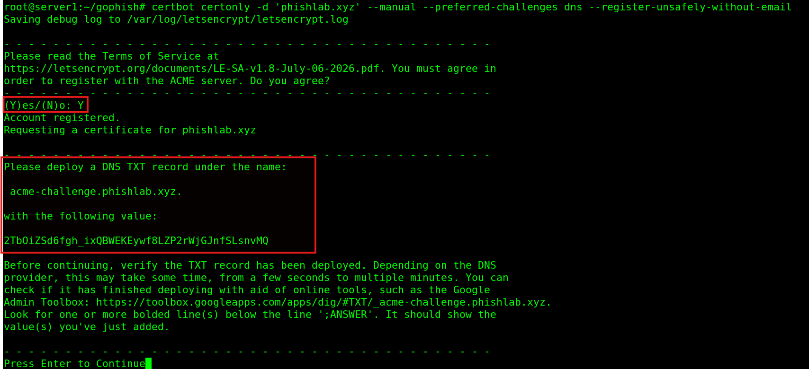

Then, add the `_acme-challenge` TXT record to your DNS configuration.  


Once done, you can use [Google Admin Toolbox](https://toolbox.googleapps.com/apps/dig/#TXT/) to check if the record was successfully added:  

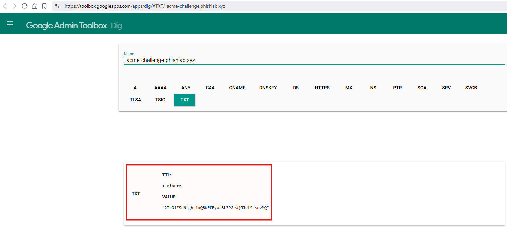

After that, go back to `certbot` command line, and press `[ENTER]` to continue.  

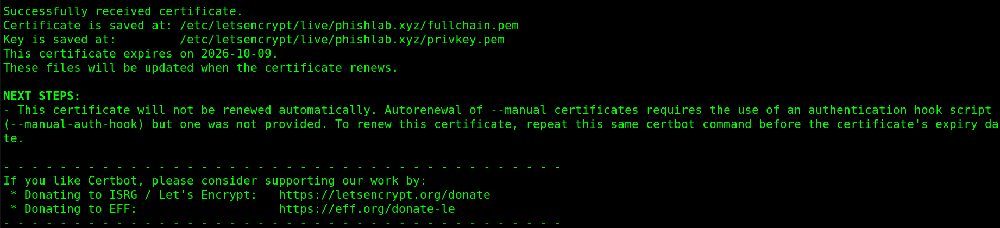

If everything goes as planned, `certbot` will generate a certificate with its corresponding private key in the `/etc/letsencrypt/live/` directory.  

Then, you can update your `config.json` file by making the following changes:  

- Change `listen_url` to 0.0.0.0:443
- Change `use_tls` to `true`
- Change `cert_path` with the certificate (.pem) generated by certbot
- Change `key_path` with the private key (.pem) generated by certbot

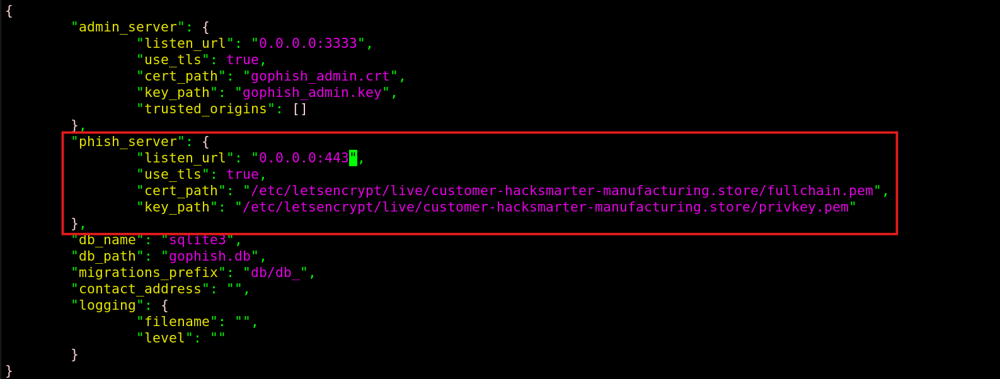

Once done, you should now be able to access your phishing website using HTTPS:  

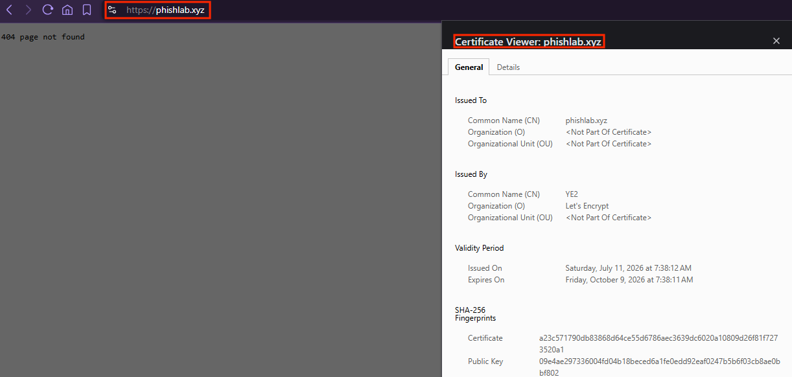

Let's now start our first phishing campaign. Shall we?  

### Sending Profiles

**[Sending Profiles](https://docs.getgophish.com/user-guide/documentation/sending-profiles)** is a GoPhish feature that allows you to configure your SMTP relay service. This is where you will specify your SMTP server, username and password, as well as the email address that will be used to send emails to your targets.  

To create a new sending profile, click on the `Sending Profiles` section:  

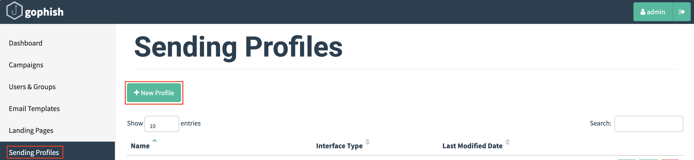

Before creating your profile, you will need to verify that you own the email address that will be used by GoPhish for sending phishing emails to your targets.  

If you used SendGrid as a SMTP relay service, go to `Settings > Sender Authentication > Single Sender Verification`:  

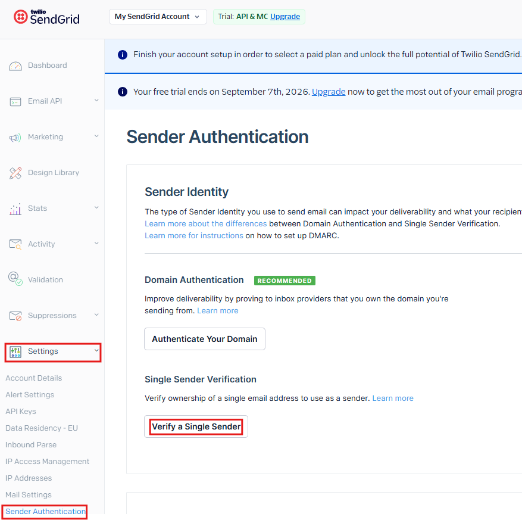

After clicking on `Verify a Single Sender`, click on `Create New Sender`:  

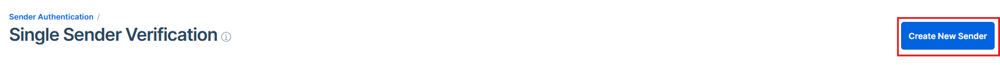

Then, fill out the fields with your information:  

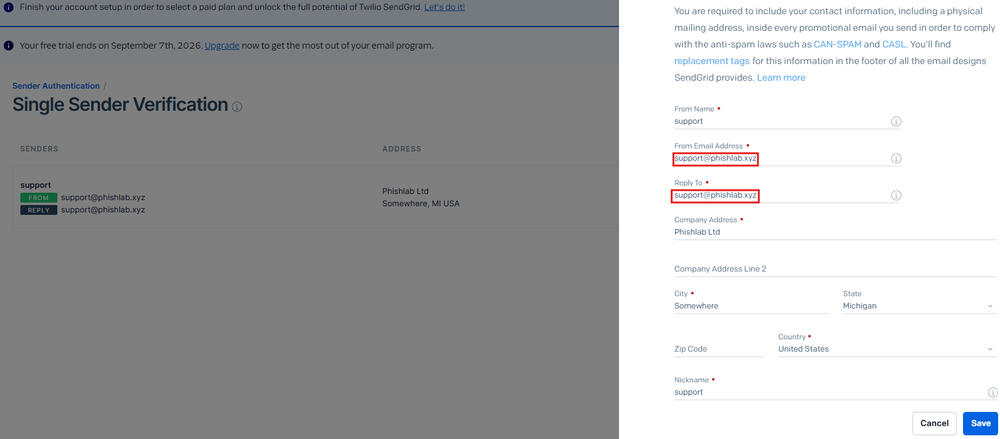

If everything goes as planned, you must see a new entry in the `Single Sender Verification` section:  

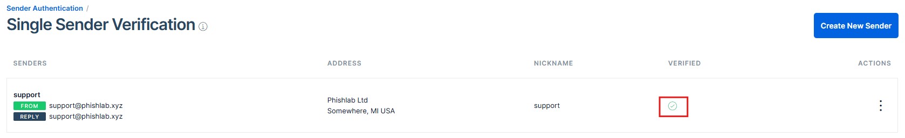

The overall configuration must look like this:  

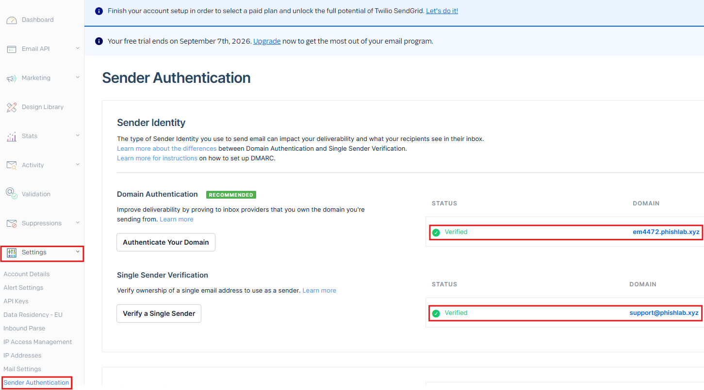

Once the `Single Sender Verification` configuration done, proceed by adding a new sending profile in GoPhish.  

To do that, complete your sending profile with these information:  

- The host is `smtp.sendgrid.net:587`
- Username is **apikey**
- Password is the API key you generated in the `Settings > API Keys` section
- SMTP From is the email address you configured in the `Single Sender Verification`

> Note that this only works for SendGrid SMTP relay service. For instance, Gmail SMTP relay service configuration will look like [this](https://youtu.be/8Q6EtC8jzpM?si=zNWM14EOkdW7yYgb&t=74).

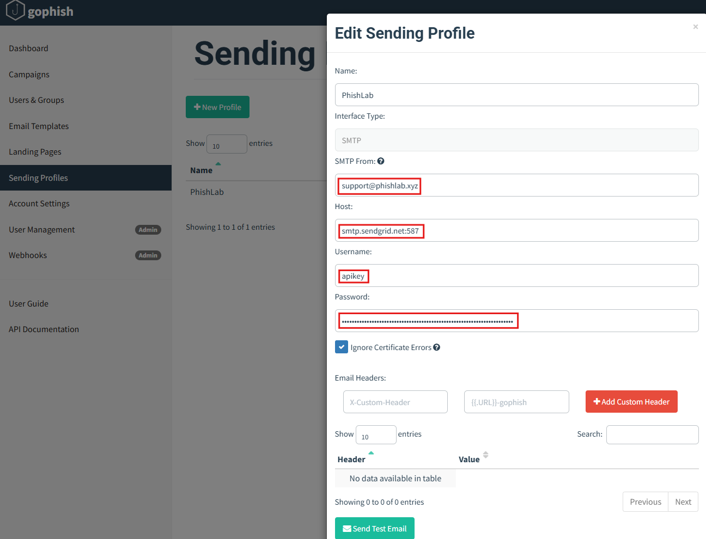

To test your sending profile configuration, you can click on `Send Test Email`. This will try to send an email to a target email address of your choice using the SMTP relay service you configured in the `Sending Profile` section.  

To generate a temporary email, you can use [temp-mail](https://temp-mail.org/).  

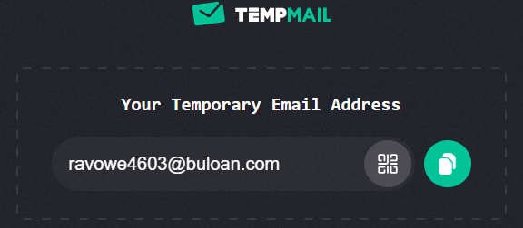

After generating your temporary email, click on `Send Test Email`, then fill out the fields and click on Send` to send your test email.  

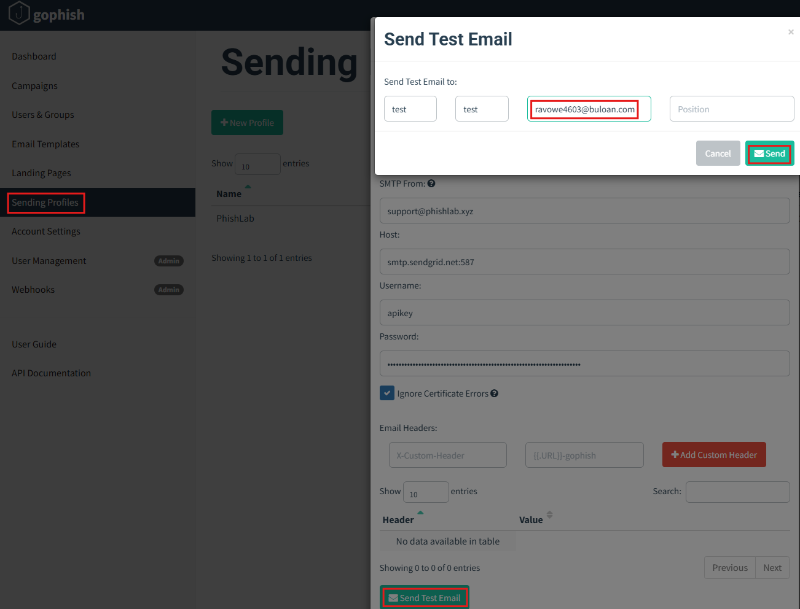

You should normally see this message:  

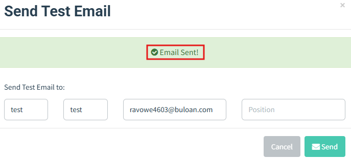

When taking a look to your temporary email's inbox, you should receive an email:  

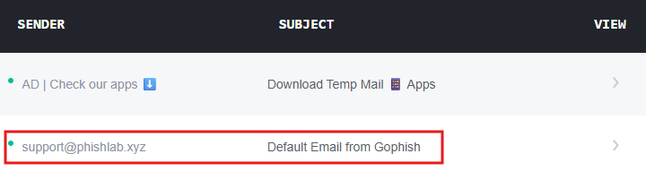

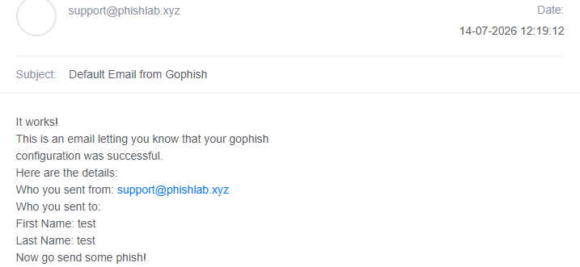

Finally save your changes to avoid losing them.

### Email Templates

**[Email templates](https://docs.getgophish.com/user-guide/documentation/templates)** is the content of the email that is sent to your targets. This is what your targets will read.  

68-importing-landing-page.png
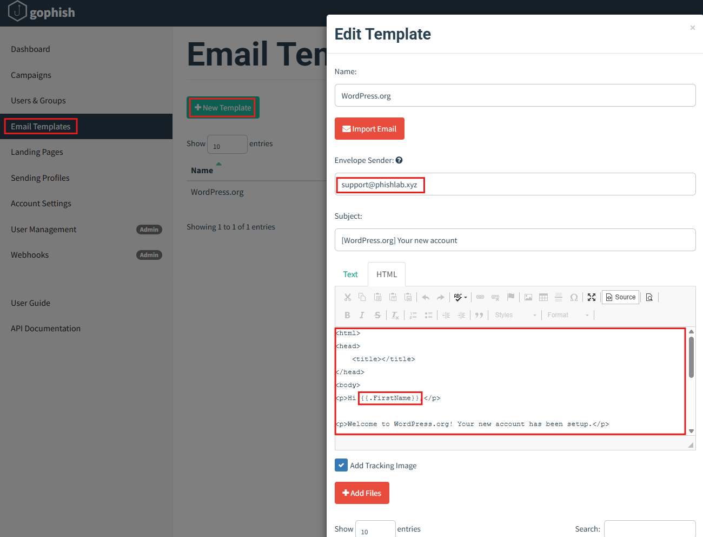

In this section, you will need to provide these information:  

- The sender email address
- The subject of the email
- The body or email template

Regarding the email template, you can use the template below. This is the default email sent by [Wordpress.org](https://wordpress.org/) after a user creates an account.  

```html
<html>
<head>
	<title></title>
</head>
<body>
  <p>Hi {{.FirstName}},</p>
  <p>Welcome to WordPress.org! Your new account has been setup.</p>
  <p>Your username is: {{.FirstName}}<br />
  You can create check the features and discounts at the following URL:<br />
  <a href="{{.URL}}">https://discount.wordpress.org/5c31730639f0b6966d872d6895a4810c/</a></p>
  
  <p>-- The WordPress.org Team</p>
{{.Tracker}}</body>
</html>
```

`{{.FirstName}}`, `{{.URL}}`, and `{{.Tracker}}` are variables that will be automatically replaced by GoPhish when you send your emails. To learn more about them, refer [here](https://docs.getgophish.com/user-guide/template-reference).

Note that you can import an email's source code using the `Import Email` button.  

As usual, make sure to save your template to not lose your modifications.  

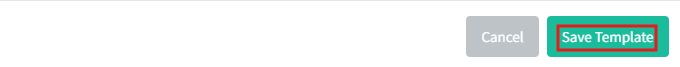

### Landing Pages

**[Landing Pages](https://docs.getgophish.com/user-guide/documentation/landing-pages)** are the phishing page that you will use to trick your targets. GoPhish has a feature called `Import Site` that allows you to clone a webpage.  

Let's try to clone [Wordpress.org's login page](https://login.wordpress.org/).  

To do that, click on the `Import Site` button on the `Landing Pages` section:  

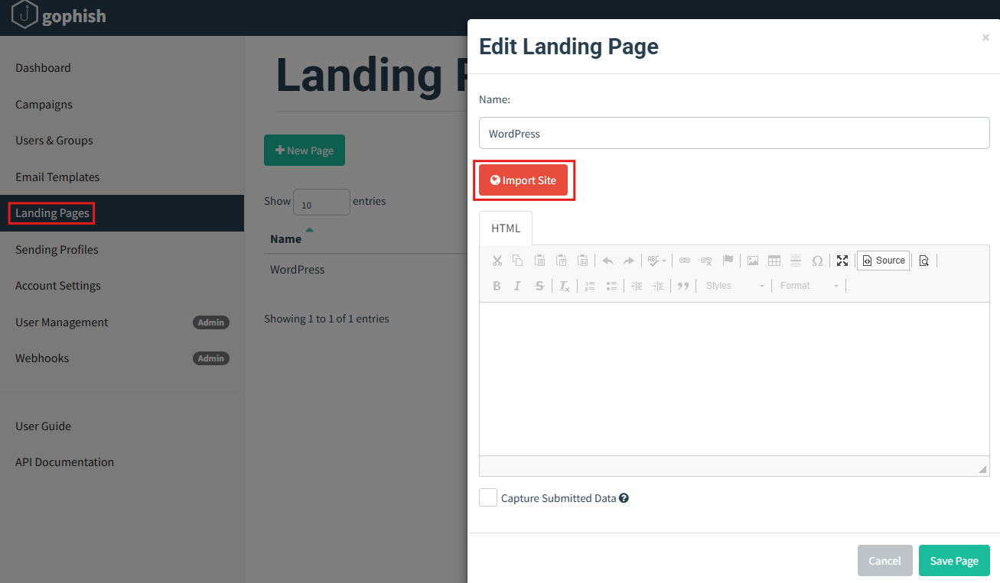

<br></br>

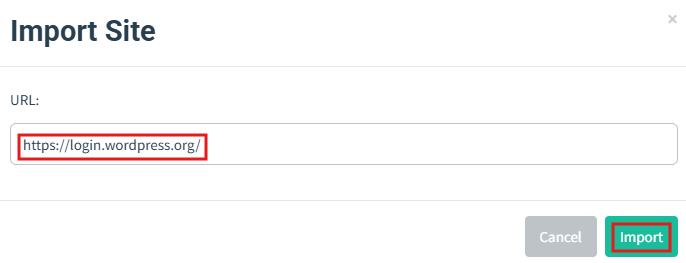

<br></br>

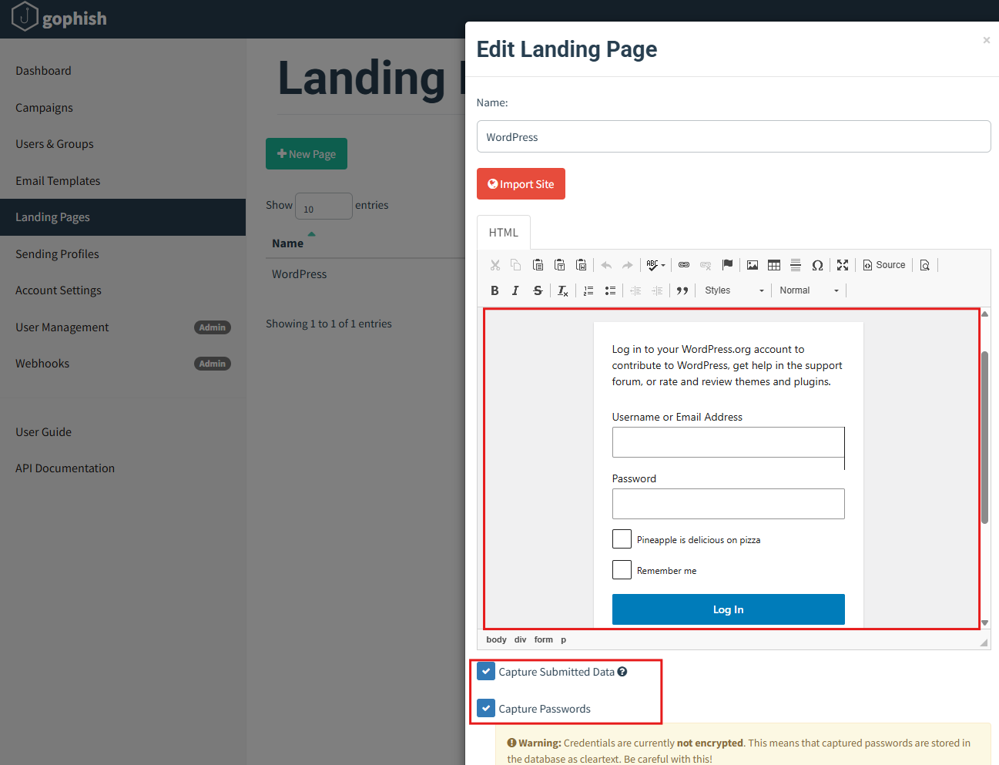

As you can see the page was successfully cloned. To capture credentials, check the "Capture Submitted Data" and "Capture Passwords" boxes. Furthermore, to avoid raising any suspicion, you can redirect the target to a website of your choice:  

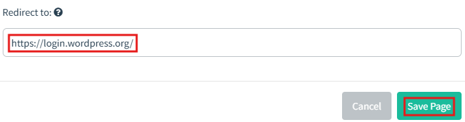

After that, save your landing page configuration.  

### Users & Groups

**[Users & Groups](https://docs.getgophish.com/user-guide/documentation/groups)** section is used to specify the target users to which your email will be sent. These users will be placed in various groups depending on their roles, permissions, etc. For instance, the email you will send to executives will not be the same as the email you will send to HR.  

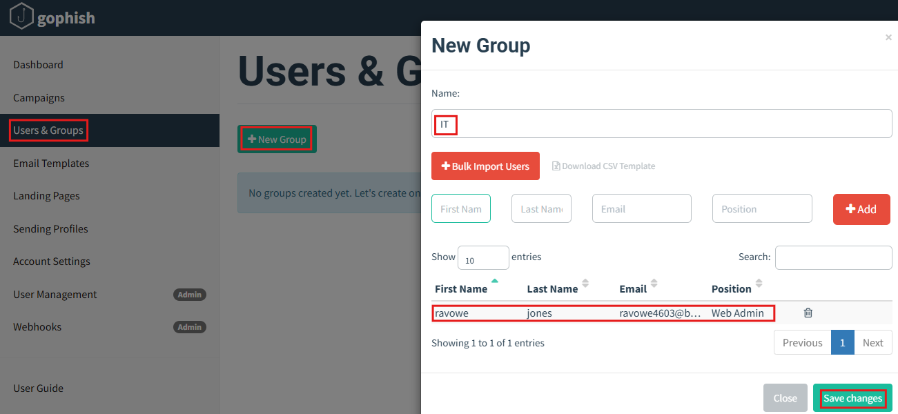

Note that, you can also add users by importing them using a `.csv` file.  

Once done, click on save.  

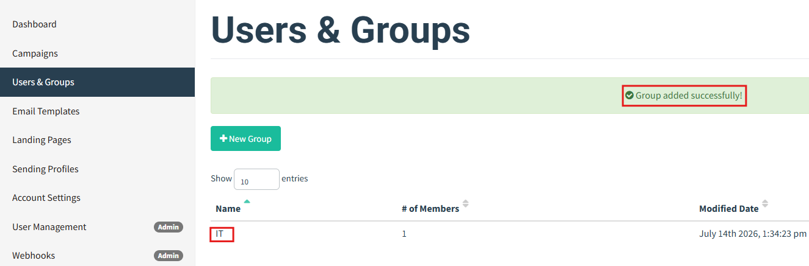


### Campaigns

**[Campaigns](https://docs.getgophish.com/user-guide/documentation/campaigns)** is a feature that is used for sending emails to one or more groups and monitoring for opened emails, clicked links, or submitted credentials.  

To launch your campaign, click on the `Campaigns` section:  

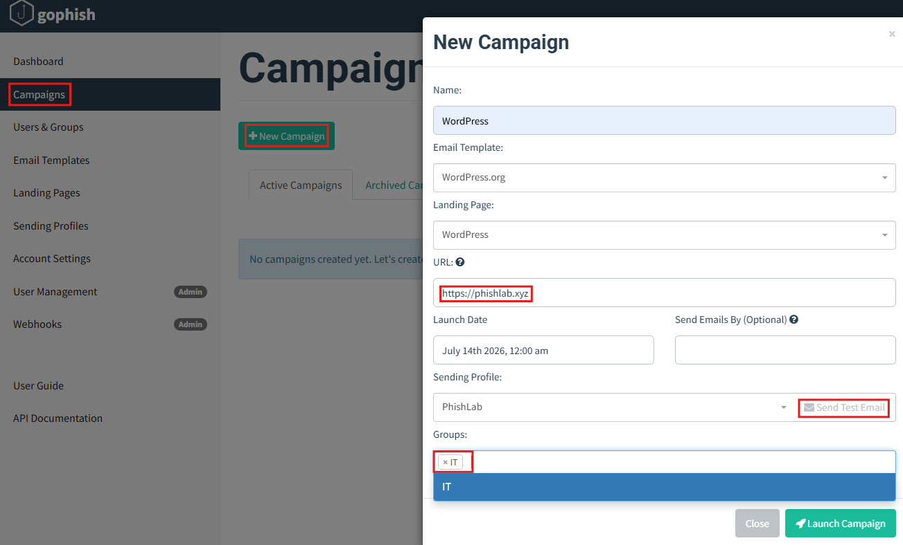

Make sure to replace the `URL` section with your phishing website URL.  

Before starting your phishing campaign, you can test if everything works properly by clicking on `Send Test Email`. Beware to not send your test email to your real targets. Use instead a [temporary email](https://temp-mail.org/).  

After that, launch your campaign by clicking on the `Launch Campaign` button:  

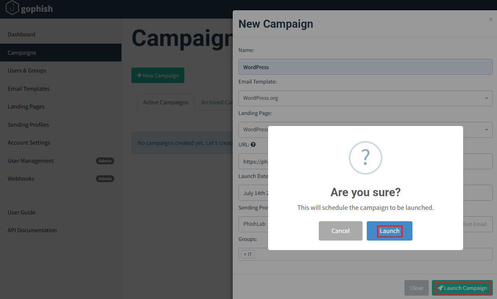

You should see a dashboard similar to this one:  

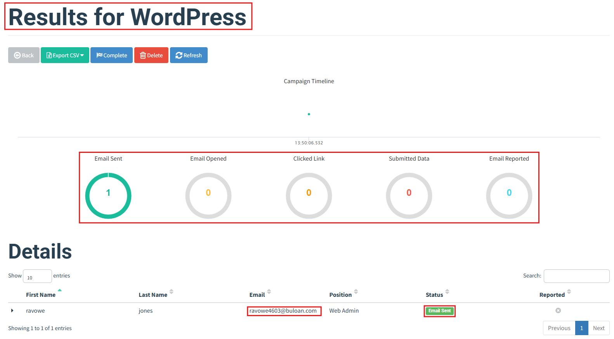

When taking a look at the target's mailbox, we can see that they receive our phishing email:  


Here is the content of the email:  

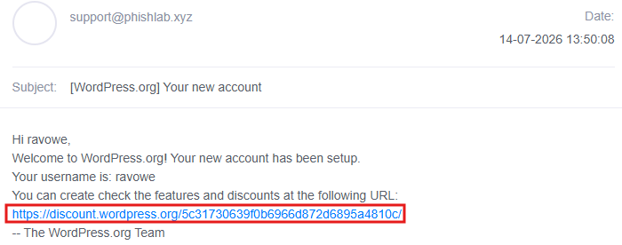

Let's try to click on the phishing link:  

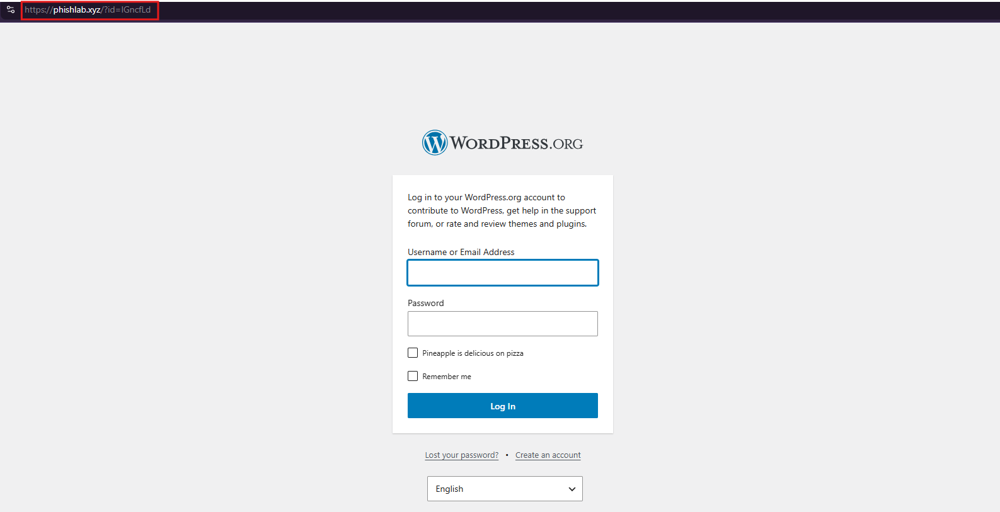

We are redirected to the phishing website specified in the `Landing Pages` section.  

When taking a look at the `Campaigns` section, you can see that GoPhish highlighted that the target opened the email address and clicked on the link.  

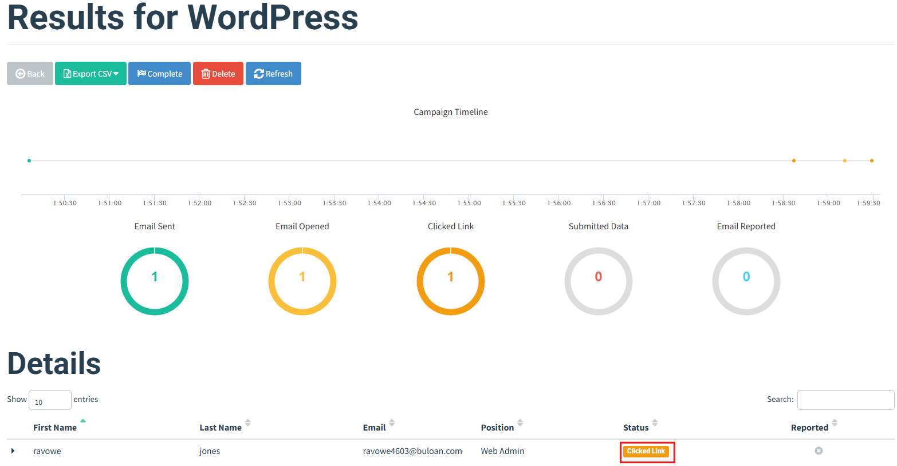

Let's now try to enter some credentials:  

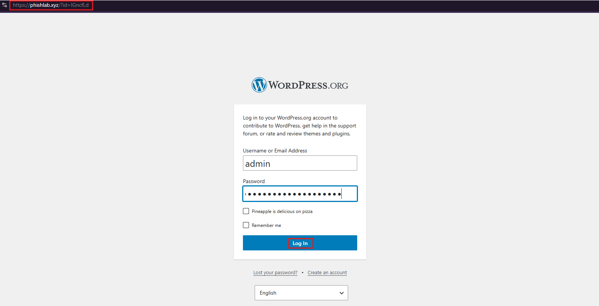

This redirected us to `https://login.wordpress.org` which is the URL we configured in the `Landing Pages` section.  

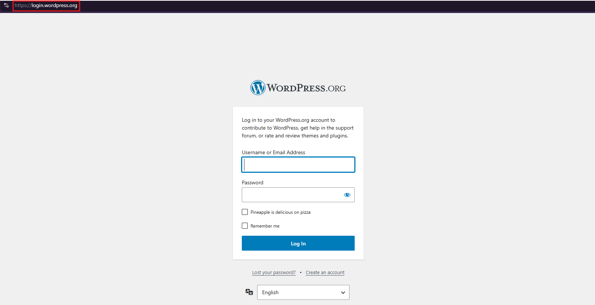

When visualizing our GoPhish campaign dashboard, we can see that the target submitted data:  

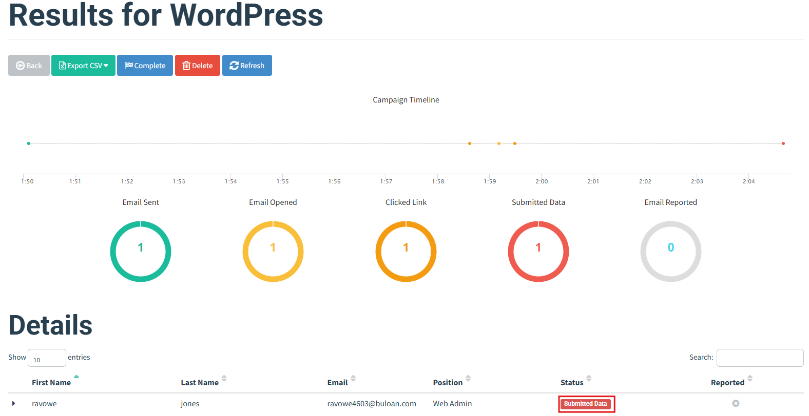

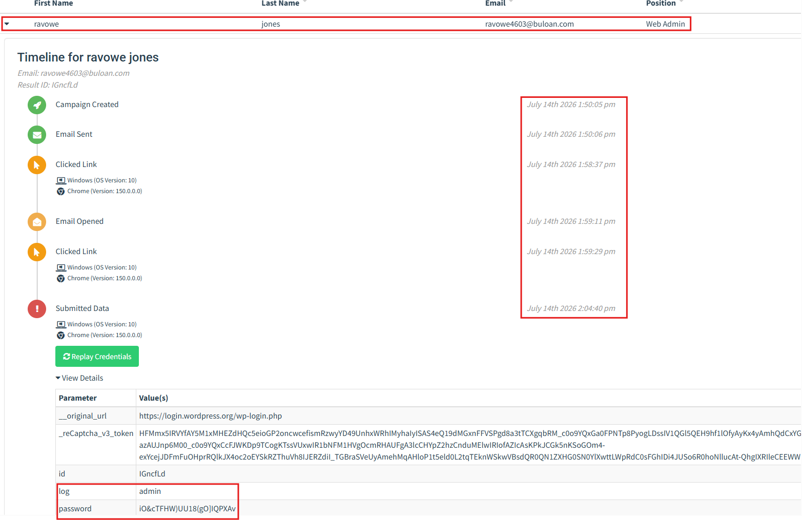

As you can see, GoPhish intercepted the username and password of the target. Using that, we can attempt to authenticate to their account.  

# Evilginx Community

[Evilginx](https://github.com/kgretzky/evilginx2) is a Man-in-The-Middle attack framework used for phishing login credentials along with session cookies. Instead of sending victims to a fake cloned website, it sits between the user and the real website, allowing attackers to perform session hijacking and bypass MFA. Indeed with a session cookie, you won't need to know a target's OTP (One Time Password) to access their account.  
Let's now see how to install and configure Evilginx.

## Installation and Configuration

Evilginx can be installed from its sources or via its pre-compiled binary. Follow the steps below to install it from source:  

```bash
git clone https://github.com/kgretzky/evilginx2
```

```bash
apt install -y golang-go
```

```bash
go build
```

> Do not interrupt the build, as it may take a few seconds to complete.  

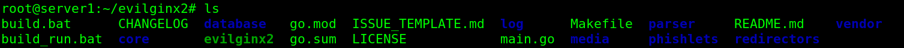

To install Evilginx using its [binary](https://github.com/kgretzky/evilginx2/releases/latest), follow these steps:  

```bash
wget https://github.com/kgretzky/evilginx2/releases/download/v3.3.0/evilginx-v3.3.0-linux-64bit.zip
```

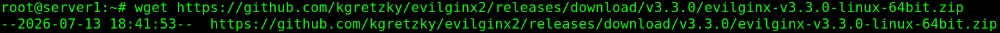

```bash
unzip evilginx-v3.3.0-linux-64bit.zip -d evilginx
```

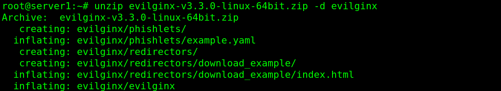

After that, give `evilginx` execution permissions:  

```bash
chmod +x ./evilginx
```

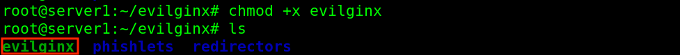

Once done, launch `evilginx`:  

```bash
./evilginx
```

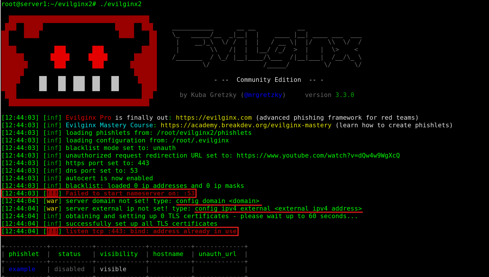

As you can see, Evilginx failed to start a DNS server on `port 53`. This occured because the port is being used by another process on the system. To check it, use this command:  

```bash
sudo lsof -i :53
```

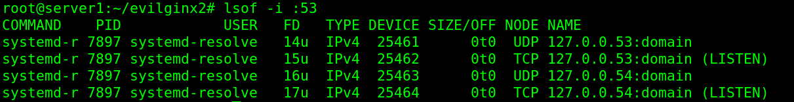

To deal with that, you will first need to stop the `systemd-resolved` service, then remove the `/etc/resolv.conf` file:  

```bash
sudo systemctl stop systemd-resolved.service
```

```bash
lsof -i :53
```

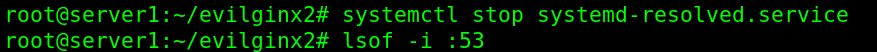

```bash
mv /etc/resolv.conf /etc/resolv.conf.bak
```


After that, execute the following command to create a new `/etc/resolv.conf` with your favorite recursive DNS servers:  

```bash
echo -e 'nameserver 1.1.1.1\nnameserver 9.9.9.9' >> /etc/resolv.conf
```

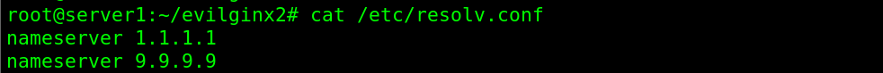

To check if the DNS resolution works, you can perform an `nslookup`:  

```bash
nslookup google.com
```

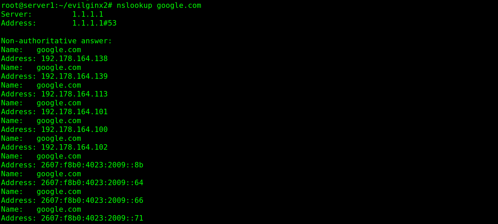

See that Evilginx uses port `tcp/443` to host your phishing website, you will need to reconfigure your GoPhish's phishing server URL to listen on another port (eg: tcp/8843).  

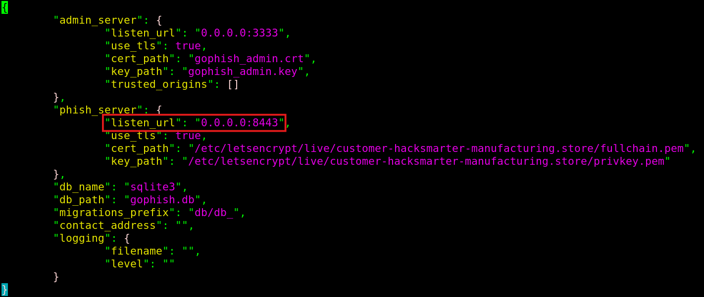

After that, restart your Gophish service to apply the changes:  

```bash
systemctl restart gophish
```

```bash
systemctl status gophish
```

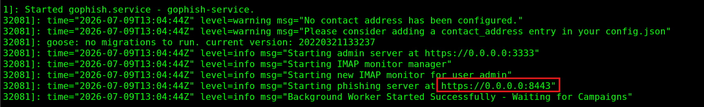

Let's now configure the domain, and the external IPv4 address:  

```
config domain <your_phishing_domain_name>
```


```
config ipv4 external <your_phishing_domain_ipv4_address>
```

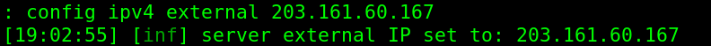

Enter the `Help` command to get some help:  

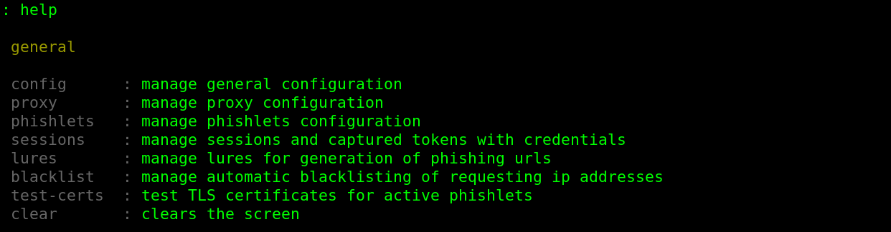

In the next section, we will learn how to configure phishlets.  

## Phishlets

[Phishlets](https://help.evilginx.com/community/guides/phishlets) are small yaml configuration files, used to configure Evilginx for targeting specific websites. By default, they are stored under the `phishlets` directory.  

```bash
cd phishlets/
```

```bash
cat example.yaml
```

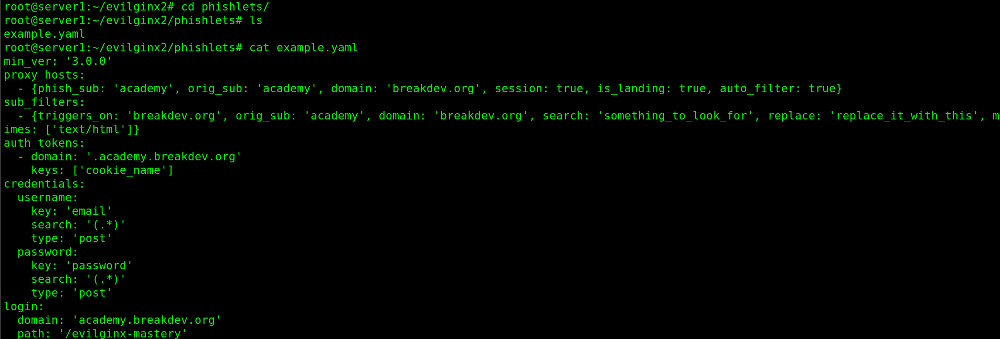

Refer to the command below to download more phishlets [here](https://github.com/An0nUD4Y/Evilginx-Phishlets).  

```bash
git clone https://github.com/An0nUD4Y/Evilginx-Phishlets.git
```

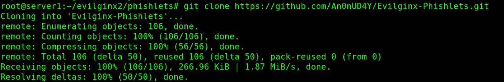

> Note that you can also create your own [phishlets](https://help.evilginx.com/pro/phishlets/) if you want to.  

Let's use the `wordpress.org.yaml` phishlet to better understand the structure of a phishlet:  

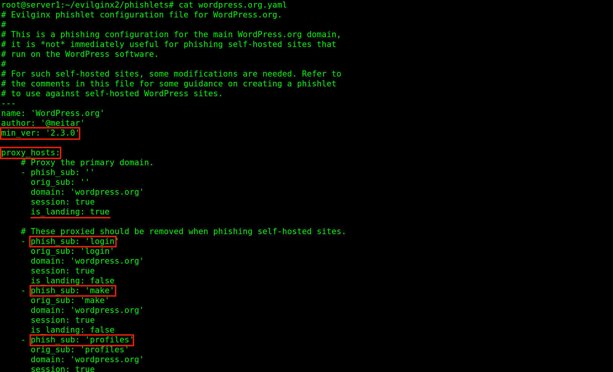

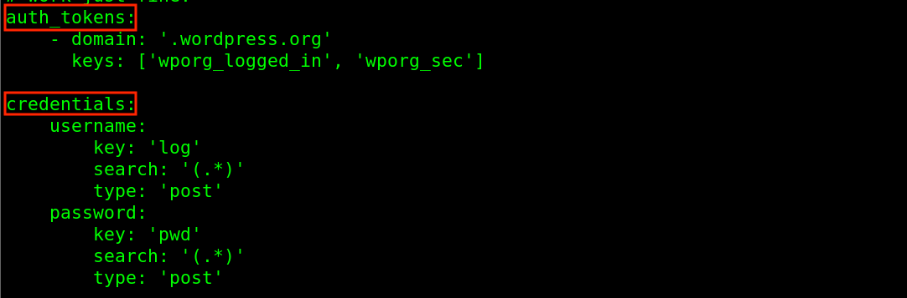

Here is a quick explanation of the different fields in the yaml file:  

- min_ver: This is the minimal version of Evilginx used by the phishlet
- proxy_hosts: Defines which subdomains to proxy to Evilginx
- auth_tokens: Represent the session tokens we want to steal
- credentials: Represent the credentials we want to capture

Note that the option `is_landing: true` tells Evilginx that this host is where victims are expected to first arrive.  

After that, add the highlighted subdomains (login, make, profiles) above to your phishing domain's DNS records as A records:  

Make sure, your phishlet is located in the `phishlets` directory, otherwise it won't be found by Evilginx:  

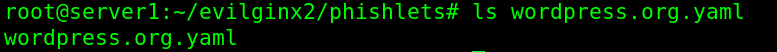

Once done, re-execute `evilginx`:  

```bash
./evilginx
```

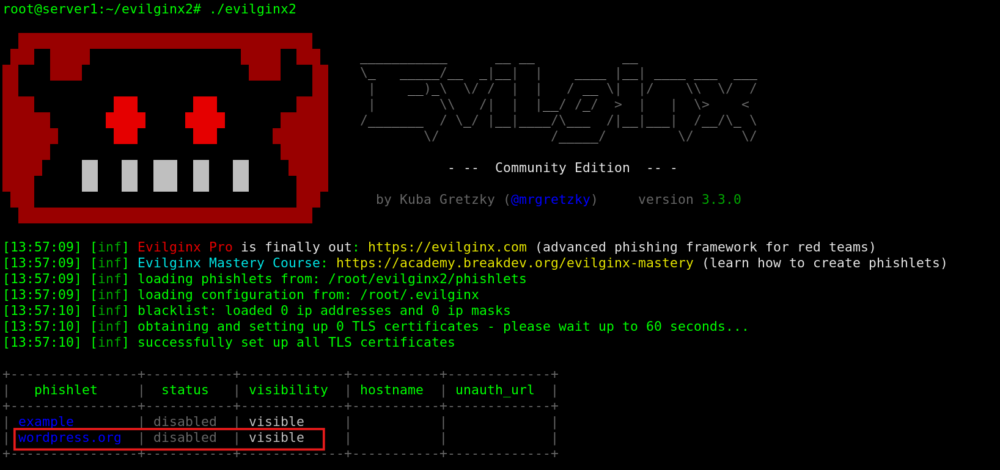

To better understand how to use the `phishlets`, use this command:  

```
help phishlets
```

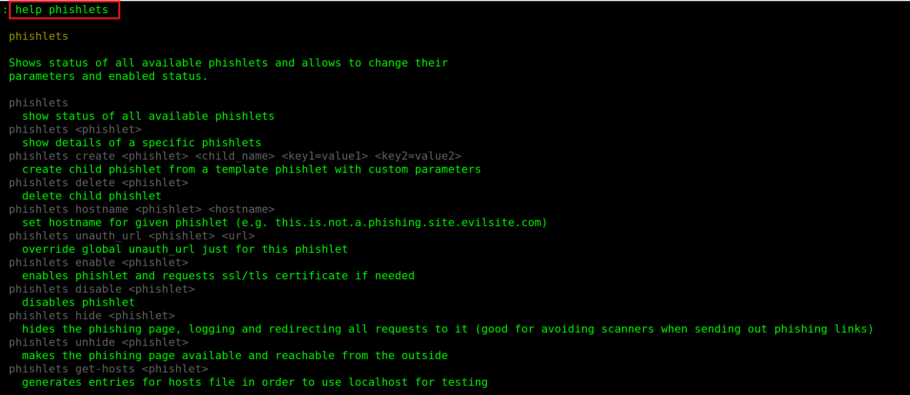

To hide the **example** phishlet, use this command:  

```
phishlets hide example
```

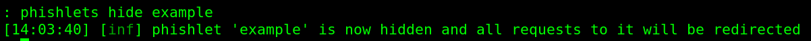

To enable `wordpress.org` phishlet and request an SSL/TLS certificate, use the following command:  

```
phishlets enable wordpress.org
```

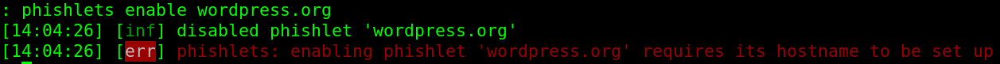

This returned an error stating that `wordpress.org` phishlet requires its hostname to be set up.  

To fix that, use this command:  

```
phishlets hostname wordpress.org <your_phishing_domain>
```

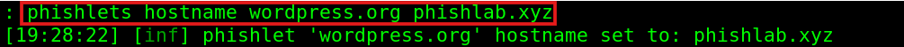

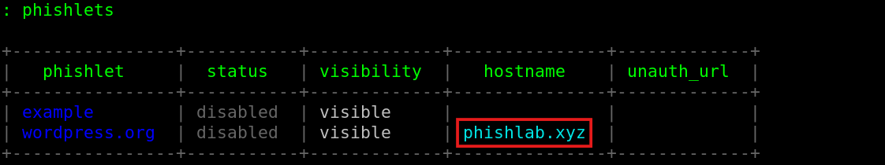

After that, enable the phishlet:  

```
phishlets enable wordpress.org
```

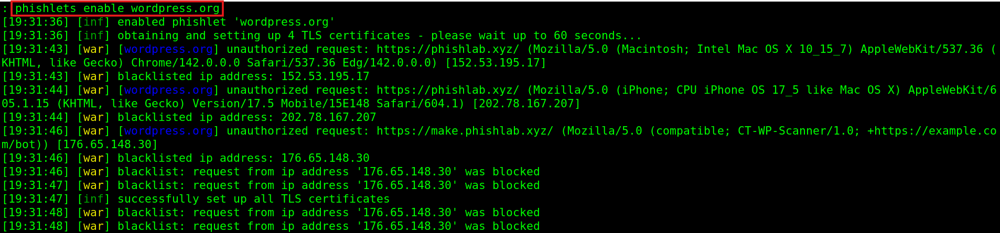

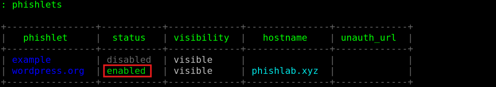

In my case, it worked. However, you may come across this error when enabling your phishlet:

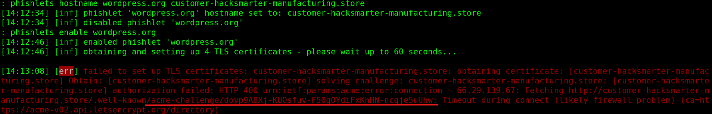

To fix that, you will need to add the `_acme_challenge` TXT record with the value returned by Evilginx.  

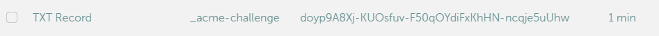

Here is a little trick to disable log output for blacklist messages:  

```bash
blacklist log off
```

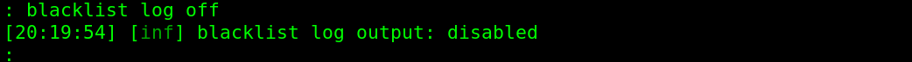

This tells Evilginx to stop showing warnings regarding blacklisted IP addresses.  
Let's now generate our phishing link using lures.  

## Lures

[Lures](https://help.evilginx.com/community/guides/lures) are pre-generated phishing links, that you will send to your targets.  

```
help lures
```

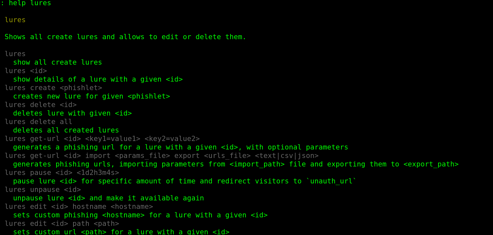


To create a lure for your `wordpress.org` phishlet, use this command:  

```
lures create wordpress.org
```

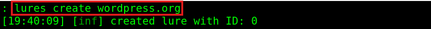

To get the lure's URL, use this command:  

```
lures get-url 0
```

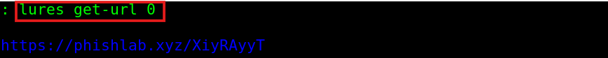

This is the link you will send to your targets.  

To display all lures, run this command:

```bash
lures
```

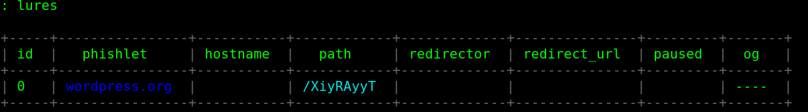

> Note that IP addresses will automatically be blacklisted by Evilginx when a user tries to access your phishing website without specifying the lure. This prevents unauthorized access and make detection harder.  

## Sessions

[Sessions](https://help.evilginx.com/community/guides/sessions) represent an history of users who cliked on your lures. Sessions also record credentials and captured session cookies.  

To start, let's copy our lure's URL and open it in our browser:    

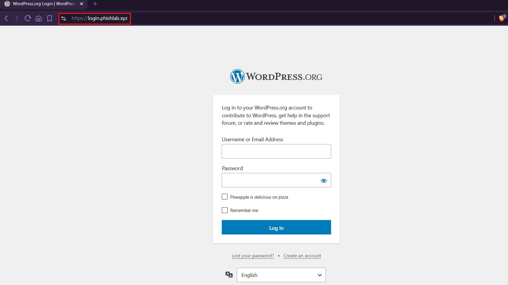

As you can see, I landed on a Wordpress login page.  

Let's now try to enter some credentials on your Wordpress phishing website:  

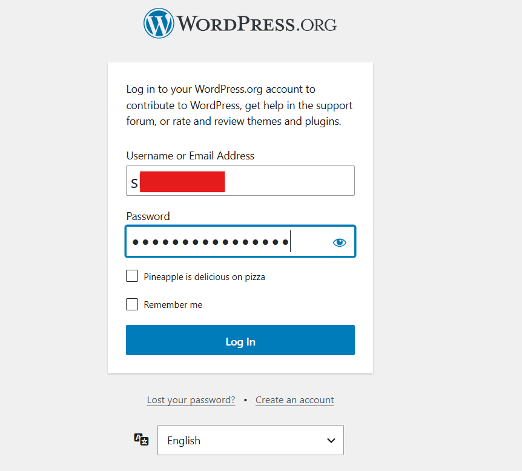

To check if Evilginx captured the credentials, use this command:  

```
sessions
```

For some reasons, it didn't work for me, but it must normally work in your scenario.   

# GoPhish x Evilginx

In this section, we will quickly see how to combine Evilginx and GoPhish.  

One of the main differences between GoPhish and Evilginx is that GoPhish is a **phishing campaign management platform**, whereas Evilginx is a **reverse-proxy framework** that does not provide built-in campaign management features like GoPhish. Additionally, Evilginx is commonly used in assessments to evaluate authentication flows involving multi-factor authentication.  

To combine GoPhish and Evilginx, create a new campaign and replace the `URL` section in GoPhish `Campaigns` with your Evilginx's lure URL, then launch your campaign.  
Here is my lure:  

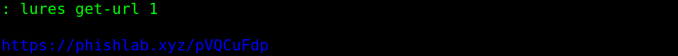

Replacing it gave me something like this:  

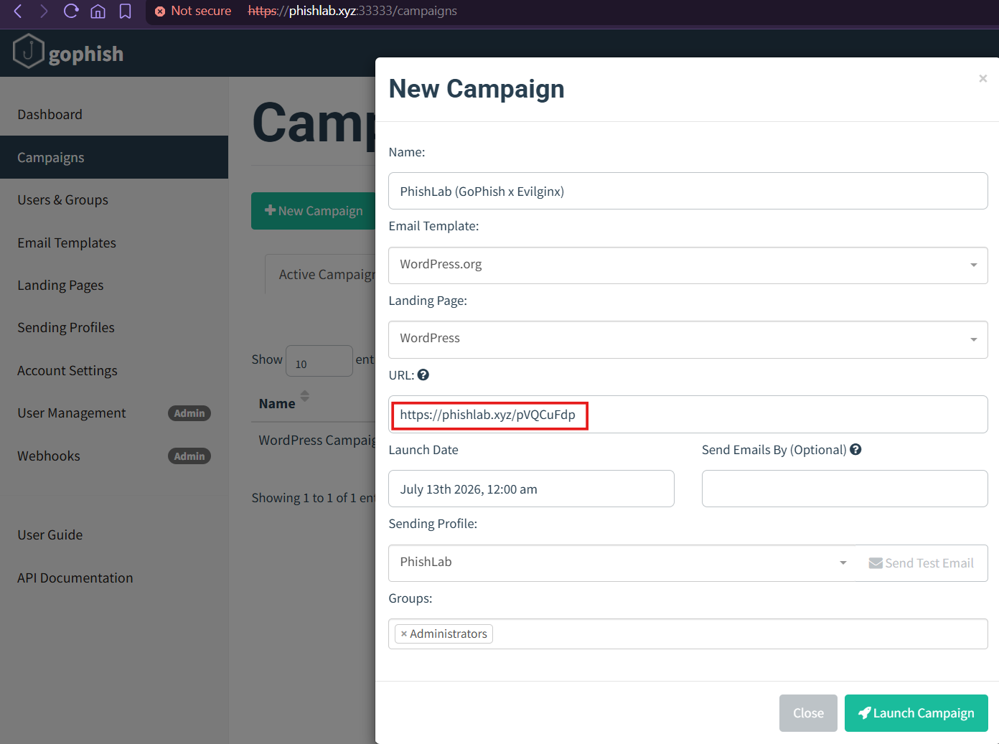

Once done, I save my settings and launch the campaign.  

When taking a look at the Campaign dashboard, we can see that the email was successfully sent.  

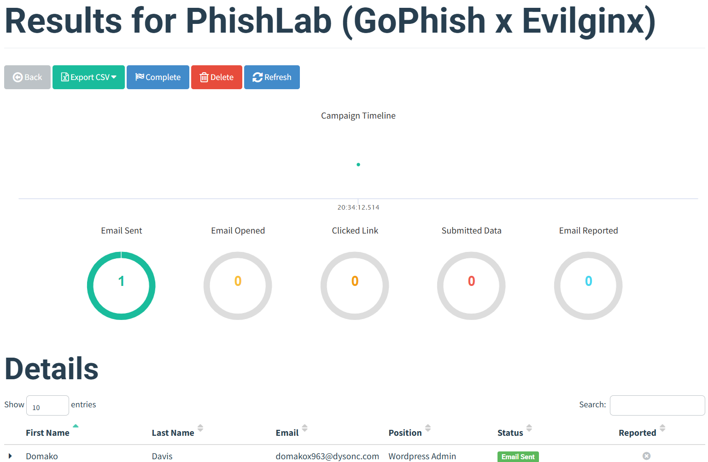

To verify that we can check the target's email inbox:  

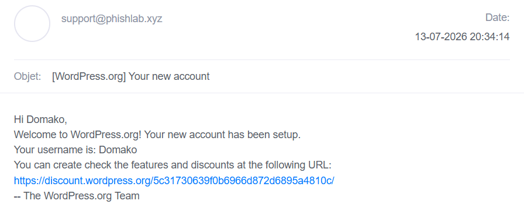

Let's click on the link in the email:  

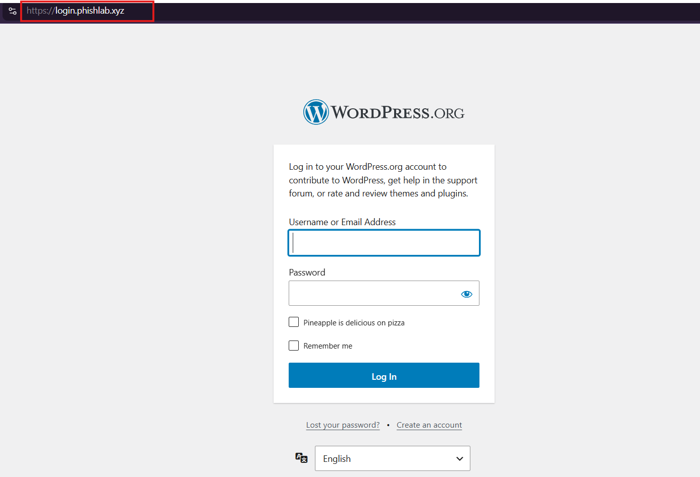

As you can notice, Evilginx captures the target's session. 

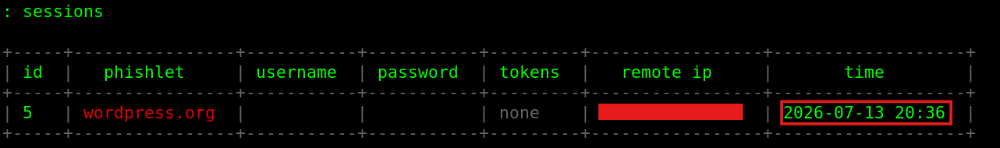

If you're curious to learn more about how to combine Evilginx and GoPhish, refer to [Evilgophish](https://github.com/fin3ss3g0d/evilgophish).  

# Pitfalls to avoid during a phishing campaign

- Replace generic greetings such as "Dear Customer" with personalized messages.
- Fix grammatical and spelling mistakes, as they can raise suspicion.
- Use high-quality images instead of low-resolution ones.
- Avoid suspicious sender email addresses, such as Gmail addresses.
- Replace random phishing URLs with custom, realistic URLs.

# Tips and Tricks

- Subscribe to the company's newsletter to identify their email naming convention and upcoming events that you can use as a pretext during our phishing campaign.
- Use [mailtrap.io](https://mailtrap.io/) to test your phishing emails before sending them to your victims.
- Check everything before launching your phishing campaign. Ensure your phishing tool captures credentials and session cookies correctly, and verify that it displays properly your phishing website across different browsers.
- Close the loop. For example, redirect users to the legitimate website after capturing their credentials so they are less likely to realize they have been phished.
- By default, Evilginx wEvilginx blocks IP addresses that access the server without a valid lure. If this happens, you will be redirected to [rickroll](https://www.youtube.com/watch?v=dQw4w9WgXcQ) video. To fix that, remove your IP address from `/root/.evilginx/blacklist.txt`

# Resources

- [A Technical Deep Dive into Modern Phishing Methodologies](https://blog.quarkslab.com/technical-dive-into-modern-phishing.html)
- [Phishing Campaign: Objectives, Methodology](https://www.vaadata.com/en/blog/phishing-campaign-objectives-methodology-spear-and-mass-phishing-examples/)
- [Practical phishing campaign | TCM Security](https://www.youtube.com/watch?v=xWLeTdKvC3Y)
- [OPSEC on the High Seas: A Gophish Adventure](https://www.youtube.com/watch?v=QG93uvylpoM)
- [BHIS | How to Build a Phishing Engagement](https://www.youtube.com/watch?v=VglCgoIjztE)
- [Evilginx-Phishing-Infra-Setup](https://github.com/An0nUD4Y/Evilginx-Phishing-Infra-Setup)
- [Using the SMTP Relay Feature with SendGrid](https://support.nimbushosting.co.uk/docs/using-the-smtp-relay-feature-with-sendgrid)
- [Domain Verification Setup Guide](https://help.mailgun.com/hc/en-us/articles/32884702360603-Domain-Verification-Setup-Guide)
- [GoPhish Documentation](https://docs.getgophish.com/user-guide)
- [Evilginx Documentation](https://help.evilginx.com/community)
- [Evilginx Reddit Feed](https://www.reddit.com/r/redteamsec/comments/183nejy/evilgophish_lures/)


# Disclaimer

This lab is intended solely for educational purposes and authorized security testing. Do not use its contents against systems or individuals without explicit permission. The authors are not responsible for any misuse or damage resulting from the use of this repository.
